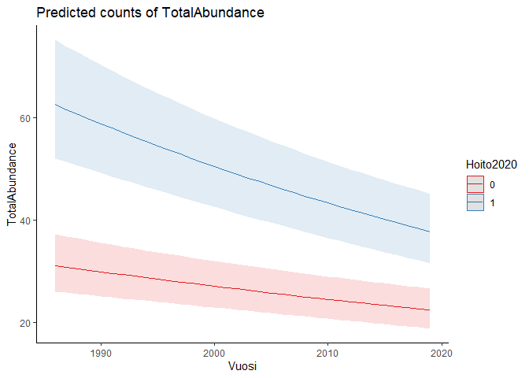

```r
library(glmmTMB)
library(ggplot2)
library(ggeffects)
library (MuMIn)
library(performance)
```


## The data

```r
mod.data = read.csv('data4model3.csv')
mod.data$NN = scale(mod.data$NNN)
mod.data$ProtectStatus = factor(mod.data$ProtectStatus, levels=c('Non-protect', 'Protect-Non-Helmi', 'Protect-Helmi'))
#str(mod.data)
```


## 1. Test whether the restored sites are in Helmi

```r
mod1 = glmmTMB(Hoito2020~ProtectStatus, 
               data=mod.data,family="binomial", REML=FALSE)
summary(mod1)
```

```
##  Family: binomial  ( logit )
## Formula:          Hoito2020 ~ ProtectStatus
## Data: mod.data
## 
##      AIC      BIC   logLik deviance df.resid 
##     2100     2120    -1047     2094     5768 
## 
## 
## Conditional model:
##                                Estimate Std. Error z value Pr(>|z|)    
## (Intercept)                     -6.6080     0.4475 -14.766  < 2e-16 ***
## ProtectStatusProtect-Non-Helmi   3.4882     0.4874   7.157 8.27e-13 ***
## ProtectStatusProtect-Helmi       7.2894     0.4511  16.160  < 2e-16 ***
## ---
## Signif. codes:  0 '***' 0.001 '**' 0.01 '*' 0.05 '.' 0.1 ' ' 1
```

```r
#r.squaredGLMM(mod1)

#plot - mod1
dat1 = ggpredict(mod1, terms = "ProtectStatus")
plot(dat1) + theme_classic()
```

<!-- -->

```r
#ggsave('restore_protect.png', dpi = 300)
```


## 2. Test the effect of protect status on waterbird abundance and population trends

```r
mod2=glmmTMB(TotalAbundance~
                 ProtectStatus*scale(Vuosi)+
                 poly(NN,2)+
                (1|SiteID), 
               data=mod.data,family = nbinom2, REML=FALSE)

summary(mod2)
```

```
##  Family: nbinom2  ( log )
## Formula:          
## TotalAbundance ~ ProtectStatus * scale(Vuosi) + poly(NN, 2) +      (1 | SiteID)
## Data: mod.data
## 
##      AIC      BIC   logLik deviance df.resid 
##  40042.2  40108.8 -20011.1  40022.2     5761 
## 
## Random effects:
## 
## Conditional model:
##  Groups Name        Variance Std.Dev.
##  SiteID (Intercept) 1.105    1.051   
## Number of obs: 5771, groups:  SiteID, 994
## 
## Dispersion parameter for nbinom2 family (): 7.22 
## 
## Conditional model:
##                                             Estimate Std. Error z value
## (Intercept)                                  1.99776    0.04585   43.57
## ProtectStatusProtect-Non-Helmi               1.14170    0.10224   11.17
## ProtectStatusProtect-Helmi                   1.65830    0.07869   21.07
## scale(Vuosi)                                -0.04362    0.01649   -2.65
## poly(NN, 2)1                                 8.55393    2.31341    3.70
## poly(NN, 2)2                                 0.36470    2.48777    0.15
## ProtectStatusProtect-Non-Helmi:scale(Vuosi) -0.10985    0.03403   -3.23
## ProtectStatusProtect-Helmi:scale(Vuosi)     -0.08189    0.02381   -3.44
##                                             Pr(>|z|)    
## (Intercept)                                  < 2e-16 ***
## ProtectStatusProtect-Non-Helmi               < 2e-16 ***
## ProtectStatusProtect-Helmi                   < 2e-16 ***
## scale(Vuosi)                                0.008159 ** 
## poly(NN, 2)1                                0.000218 ***
## poly(NN, 2)2                                0.883451    
## ProtectStatusProtect-Non-Helmi:scale(Vuosi) 0.001245 ** 
## ProtectStatusProtect-Helmi:scale(Vuosi)     0.000584 ***
## ---
## Signif. codes:  0 '***' 0.001 '**' 0.01 '*' 0.05 '.' 0.1 ' ' 1
```

```r
r.squaredGLMM(mod2)
```

```
##                 R2m       R2c
## delta     0.3052027 0.9078319
## lognormal 0.3073568 0.9142393
## trigamma  0.3027132 0.9004267
```

```r
check_collinearity(mod2)
```

```
## # Check for Multicollinearity
## 
## Low Correlation
## 
##                        Term  VIF   VIF 95% CI Increased SE Tolerance
##               ProtectStatus 1.05 [1.03, 1.09]         1.03      0.95
##                scale(Vuosi) 2.23 [2.14, 2.32]         1.49      0.45
##                 poly(NN, 2) 1.05 [1.03, 1.09]         1.03      0.95
##  ProtectStatus:scale(Vuosi) 2.23 [2.15, 2.33]         1.49      0.45
##  Tolerance 95% CI
##      [0.92, 0.97]
##      [0.43, 0.47]
##      [0.92, 0.97]
##      [0.43, 0.47]
```

```r
#plot - mod2
dat2 = ggpredict(mod2, terms = c("Vuosi[all]","ProtectStatus"))
plot(dat2) + theme_classic()
```

<!-- -->

```r
#ggsave('protect.png', dpi = 300)
```


## 3. Test the effect of restoration action before 2020 on waterbird abundance and population trends
### For mod3, only the protected sites are included

```r
mod.data2 = mod.data[mod.data$ProtectStatus!='Non-protect',]
mod.data2$Hoito2020 = as.factor(mod.data2$Hoito2020)

mod3=glmmTMB(TotalAbundance~Hoito2020*scale(Vuosi)+
                 poly(NN,2)+
                 (1|SiteID), 
               data=mod.data2,family = nbinom2, REML=FALSE)

summary(mod3)
```

```
##  Family: nbinom2  ( log )
## Formula:          
## TotalAbundance ~ Hoito2020 * scale(Vuosi) + poly(NN, 2) + (1 |      SiteID)
## Data: mod.data2
## 
##      AIC      BIC   logLik deviance df.resid 
##  18140.8  18185.8  -9062.4  18124.8     2053 
## 
## Random effects:
## 
## Conditional model:
##  Groups Name        Variance Std.Dev.
##  SiteID (Intercept) 1.089    1.043   
## Number of obs: 2061, groups:  SiteID, 422
## 
## Dispersion parameter for nbinom2 family (): 7.93 
## 
## Conditional model:
##                         Estimate Std. Error z value Pr(>|z|)    
## (Intercept)              3.23673    0.06960   46.51  < 2e-16 ***
## Hoito20201               0.60977    0.10876    5.61 2.06e-08 ***
## scale(Vuosi)            -0.10410    0.01929   -5.40 6.82e-08 ***
## poly(NN, 2)1             6.60375    2.15507    3.06  0.00218 ** 
## poly(NN, 2)2            -2.01853    2.16909   -0.93  0.35207    
## Hoito20201:scale(Vuosi) -0.05585    0.02792   -2.00  0.04549 *  
## ---
## Signif. codes:  0 '***' 0.001 '**' 0.01 '*' 0.05 '.' 0.1 ' ' 1
```

```r
r.squaredGLMM(mod3)
```

```
##                 R2m       R2c
## delta     0.1102572 0.8969362
## lognormal 0.1110030 0.9030032
## trigamma  0.1094148 0.8900837
```

```r
check_collinearity(mod3)
```

```
## # Check for Multicollinearity
## 
## Low Correlation
## 
##                    Term  VIF   VIF 95% CI Increased SE Tolerance
##               Hoito2020 1.05 [1.02, 1.13]         1.02      0.95
##            scale(Vuosi) 1.92 [1.80, 2.05]         1.38      0.52
##             poly(NN, 2) 1.05 [1.02, 1.13]         1.02      0.95
##  Hoito2020:scale(Vuosi) 1.92 [1.80, 2.05]         1.39      0.52
##  Tolerance 95% CI
##      [0.89, 0.98]
##      [0.49, 0.55]
##      [0.89, 0.98]
##      [0.49, 0.55]
```

```r
#plot - mod3
dat3 = ggpredict(mod3, terms = c("Vuosi[all]","Hoito2020"))
plot(dat3) + theme_classic()
```

<!-- -->

```r
#ggsave('restore.png', dpi = 300)
```

