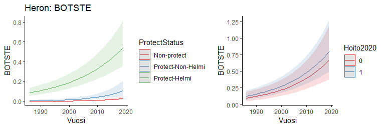
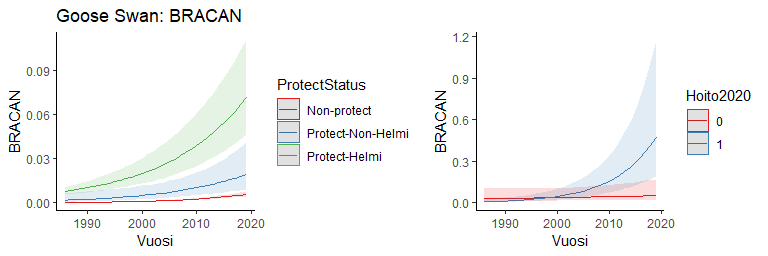
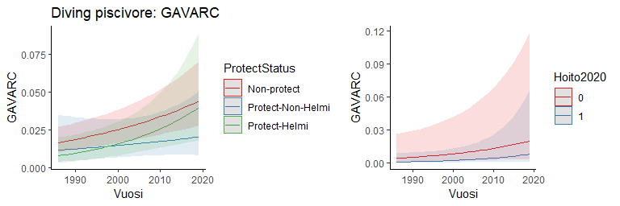
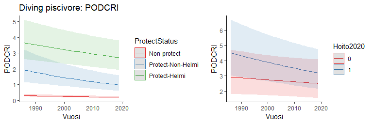
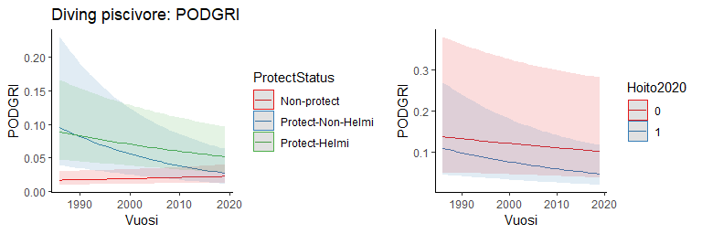

```r
library(glmmTMB)
library(ggplot2)
library(ggeffects)
library (MuMIn)
library(dplyr)
library(cowplot)
```


## The data

```r
mod.data = read.csv('data4model3.csv')
mod.data$NN = scale(mod.data$NNN)
mod.data$ProtectStatus = factor(mod.data$ProtectStatus, levels=c('Non-protect', 'Protect-Non-Helmi', 'Protect-Helmi'))

# species list
species = data.frame(species = colnames(mod.data[,10:45]),
                     tcount = colSums(mod.data[,10:45],na.rm = T), 
                     nobs = colSums(!is.na(mod.data[,10:45])))
guild = read.csv('guilds_20230804.csv')
species = merge(species, guild, by = 'species', all.x = T)

#Select the species with over 100 counted individuals and over 5000 observations
species = species[species$tcount>=100 & species$nobs>=5000,]
# 21 species left
species =
  species %>% mutate(Guild = recode(guild_name, 
                                       "dabbling ducks" = "Dabbling duck",
                                       "diving omnivores" = "Diving omnivore",
                                       "diving piscivores" = "Diving piscivore",
                                       "herons" = "Heron",
                                       .default = "Goose Swan")) 
summary(as.factor(species$Guild))
```

```
##    Dabbling duck  Diving omnivore Diving piscivore       Goose Swan            Heron 
##                6                6                6                2                1
```

```r
# 5 guilds

splist = species$species
splist
```

```
##  [1] "ANAACU" "ANACLY" "ANACRE" "ANAPEN" "ANAPLA" "ANAQUE" "AYTFER" "AYTFUL" "BOTSTE" "BRACAN"
## [11] "BUCCLA" "CYGCYG" "FULATR" "GAVARC" "MELFUS" "MERALB" "MERMER" "MERSER" "PODAUR" "PODCRI"
## [21] "PODGRI"
```


## 1. Test the effect of protect status on waterbird abundance and population trends
## 2. Test the effect of restoration action before 2020 on waterbird abundance and population trends

```r
for (i in 1:length(splist)){
mod.data1 = mod.data[!is.na(mod.data[,splist[i]]),]
## 1. Test the effect of protect status on waterbird abundance and population trends
mod2=glmmTMB(get(splist[i])~
               ProtectStatus*scale(Vuosi)+
               poly(NN,2)+
               (1|SiteID), 
             data=mod.data1,family = nbinom2, REML=FALSE)
print(paste(species$Guild[i], splist[i], sep = ": "))
print(summary(mod2))
print(r.squaredGLMM(mod2))
dat2 = ggpredict(mod2, terms = c("Vuosi[all]","ProtectStatus"))
p1 = plot(dat2) + theme_classic() + 
  ylab(splist[i]) + ggtitle(paste(species$Guild[i], splist[i], sep = ": "))


## 2. Test the effect of restoration action before 2020 on waterbird abundance and population trends
mod.data2 = mod.data1[mod.data1$ProtectStatus=='Protect-Helmi',]
mod.data2$Hoito2020 = as.factor(mod.data2$Hoito2020)
mod3=glmmTMB(get(splist[i])~Hoito2020*scale(Vuosi)+
               poly(NN,2)+
               (1|SiteID), 
             data=mod.data2,family = nbinom2, REML=FALSE)
print(paste(species$Guild[i], splist[i], sep = ": "))
print(summary(mod3))
print(r.squaredGLMM(mod3))
dat3 = ggpredict(mod3, terms = c("Vuosi[all]","Hoito2020"))
p2 = plot(dat3) + theme_classic()+ 
  ylab(splist[i]) + ggtitle("")

print(plot_grid(p1, p2, align = 'h', ncol=2, rel_widths=c(1,0.8)))
}
```

```
## [1] "Dabbling duck: ANAACU"
##  Family: nbinom2  ( log )
## Formula:          get(splist[i]) ~ ProtectStatus * scale(Vuosi) + poly(NN, 2) +      (1 | SiteID)
## Data: mod.data1
## 
##      AIC      BIC   logLik deviance df.resid 
##   5054.9   5120.7  -2517.5   5034.9     5280 
## 
## Random effects:
## 
## Conditional model:
##  Groups Name        Variance Std.Dev.
##  SiteID (Intercept) 3.056    1.748   
## Number of obs: 5290, groups:  SiteID, 886
## 
## Dispersion parameter for nbinom2 family (): 6.37 
## 
## Conditional model:
##                                             Estimate Std. Error z value Pr(>|z|)    
## (Intercept)                                  -4.8006     0.1925 -24.936  < 2e-16 ***
## ProtectStatusProtect-Non-Helmi                1.9303     0.2698   7.154 8.43e-13 ***
## ProtectStatusProtect-Helmi                    3.5542     0.2165  16.419  < 2e-16 ***
## scale(Vuosi)                                 -0.6603     0.0869  -7.599 2.99e-14 ***
## poly(NN, 2)1                                107.0746     6.4305  16.651  < 2e-16 ***
## poly(NN, 2)2                                -46.4494     6.4715  -7.178 7.10e-13 ***
## ProtectStatusProtect-Non-Helmi:scale(Vuosi)   0.1841     0.1430   1.288   0.1978    
## ProtectStatusProtect-Helmi:scale(Vuosi)       0.1752     0.1010   1.735   0.0827 .  
## ---
## Signif. codes:  0 '***' 0.001 '**' 0.01 '*' 0.05 '.' 0.1 ' ' 1
##                 R2m       R2c
## delta     0.6272618 0.9809046
## lognormal 0.6281545 0.9823007
## trigamma  0.6262211 0.9792773
## [1] "Dabbling duck: ANAACU"
##  Family: nbinom2  ( log )
## Formula:          get(splist[i]) ~ Hoito2020 * scale(Vuosi) + poly(NN, 2) + (1 |      SiteID)
## Data: mod.data2
## 
##      AIC      BIC   logLik deviance df.resid 
##   2782.3   2821.8  -1383.1   2766.3     1025 
## 
## Random effects:
## 
## Conditional model:
##  Groups Name        Variance Std.Dev.
##  SiteID (Intercept) 1.836    1.355   
## Number of obs: 1033, groups:  SiteID, 203
## 
## Dispersion parameter for nbinom2 family (): 8.77 
## 
## Conditional model:
##                         Estimate Std. Error z value Pr(>|z|)    
## (Intercept)              -1.1224     0.2123  -5.288 1.24e-07 ***
## Hoito20201                0.8275     0.2490   3.324 0.000888 ***
## scale(Vuosi)             -0.3467     0.1104  -3.142 0.001681 ** 
## poly(NN, 2)1             41.4633     3.9257  10.562  < 2e-16 ***
## poly(NN, 2)2            -19.1556     3.7317  -5.133 2.85e-07 ***
## Hoito20201:scale(Vuosi)  -0.1126     0.1209  -0.931 0.351732    
## ---
## Signif. codes:  0 '***' 0.001 '**' 0.01 '*' 0.05 '.' 0.1 ' ' 1
##                 R2m       R2c
## delta     0.5504401 0.9308157
## lognormal 0.5557145 0.9397348
## trigamma  0.5434759 0.9190389
```

<!-- -->

```
## [1] "Dabbling duck: ANACLY"
##  Family: nbinom2  ( log )
## Formula:          get(splist[i]) ~ ProtectStatus * scale(Vuosi) + poly(NN, 2) +      (1 | SiteID)
## Data: mod.data1
## 
##      AIC      BIC   logLik deviance df.resid 
##   9132.7   9198.8  -4556.3   9112.7     5498 
## 
## Random effects:
## 
## Conditional model:
##  Groups Name        Variance Std.Dev.
##  SiteID (Intercept) 3.115    1.765   
## Number of obs: 5508, groups:  SiteID, 929
## 
## Dispersion parameter for nbinom2 family ():  5.8 
## 
## Conditional model:
##                                              Estimate Std. Error z value Pr(>|z|)    
## (Intercept)                                  -3.27888    0.13336 -24.587  < 2e-16 ***
## ProtectStatusProtect-Non-Helmi                2.19912    0.22299   9.862  < 2e-16 ***
## ProtectStatusProtect-Helmi                    3.73646    0.17359  21.525  < 2e-16 ***
## scale(Vuosi)                                 -0.07786    0.06109  -1.275  0.20245    
## poly(NN, 2)1                                 16.54259    4.84523   3.414  0.00064 ***
## poly(NN, 2)2                                -11.34399    5.35839  -2.117  0.03426 *  
## ProtectStatusProtect-Non-Helmi:scale(Vuosi)  -0.26896    0.10666  -2.522  0.01168 *  
## ProtectStatusProtect-Helmi:scale(Vuosi)      -0.11536    0.07013  -1.645  0.10001    
## ---
## Signif. codes:  0 '***' 0.001 '**' 0.01 '*' 0.05 '.' 0.1 ' ' 1
##                 R2m       R2c
## delta     0.4202341 0.9242876
## lognormal 0.4260290 0.9370332
## trigamma  0.4118460 0.9058383
## [1] "Dabbling duck: ANACLY"
##  Family: nbinom2  ( log )
## Formula:          get(splist[i]) ~ Hoito2020 * scale(Vuosi) + poly(NN, 2) + (1 |      SiteID)
## Data: mod.data2
## 
##      AIC      BIC   logLik deviance df.resid 
##   4977.0   5017.9  -2480.5   4961.0     1221 
## 
## Random effects:
## 
## Conditional model:
##  Groups Name        Variance Std.Dev.
##  SiteID (Intercept) 1.293    1.137   
## Number of obs: 1229, groups:  SiteID, 242
## 
## Dispersion parameter for nbinom2 family (): 7.39 
## 
## Conditional model:
##                         Estimate Std. Error z value Pr(>|z|)    
## (Intercept)              0.20483    0.13945   1.469   0.1419    
## Hoito20201               0.71639    0.17331   4.133 3.57e-05 ***
## scale(Vuosi)            -0.29897    0.06491  -4.606 4.10e-06 ***
## poly(NN, 2)1             5.81312    2.66691   2.180   0.0293 *  
## poly(NN, 2)2            -6.59727    2.82961  -2.332   0.0197 *  
## Hoito20201:scale(Vuosi)  0.17577    0.07319   2.402   0.0163 *  
## ---
## Signif. codes:  0 '***' 0.001 '**' 0.01 '*' 0.05 '.' 0.1 ' ' 1
##                 R2m       R2c
## delta     0.1330287 0.7988986
## lognormal 0.1373325 0.8247447
## trigamma  0.1273915 0.7650448
```

<!-- -->

```
## [1] "Dabbling duck: ANACRE"
##  Family: nbinom2  ( log )
## Formula:          get(splist[i]) ~ ProtectStatus * scale(Vuosi) + poly(NN, 2) +      (1 | SiteID)
## Data: mod.data1
## 
##      AIC      BIC   logLik deviance df.resid 
##  20378.6  20445.1 -10179.3  20358.6     5713 
## 
## Random effects:
## 
## Conditional model:
##  Groups Name        Variance Std.Dev.
##  SiteID (Intercept) 1.198    1.094   
## Number of obs: 5723, groups:  SiteID, 991
## 
## Dispersion parameter for nbinom2 family (): 2.87 
## 
## Conditional model:
##                                             Estimate Std. Error z value Pr(>|z|)    
## (Intercept)                                 -0.38301    0.05579  -6.865 6.64e-12 ***
## ProtectStatusProtect-Non-Helmi               1.27698    0.11987  10.653  < 2e-16 ***
## ProtectStatusProtect-Helmi                   1.92384    0.09050  21.258  < 2e-16 ***
## scale(Vuosi)                                -0.01699    0.03216  -0.528  0.59734    
## poly(NN, 2)1                                22.49366    2.65524   8.471  < 2e-16 ***
## poly(NN, 2)2                                -8.68793    2.86710  -3.030  0.00244 ** 
## ProtectStatusProtect-Non-Helmi:scale(Vuosi) -0.08143    0.06296  -1.293  0.19590    
## ProtectStatusProtect-Helmi:scale(Vuosi)     -0.08151    0.04417  -1.845  0.06501 .  
## ---
## Signif. codes:  0 '***' 0.001 '**' 0.01 '*' 0.05 '.' 0.1 ' ' 1
##                 R2m       R2c
## delta     0.3115986 0.7738237
## lognormal 0.3273655 0.8129792
## trigamma  0.2889236 0.7175126
## [1] "Dabbling duck: ANACRE"
##  Family: nbinom2  ( log )
## Formula:          get(splist[i]) ~ Hoito2020 * scale(Vuosi) + poly(NN, 2) + (1 |      SiteID)
## Data: mod.data2
## 
##      AIC      BIC   logLik deviance df.resid 
##   7644.6   7686.4  -3814.3   7628.6     1359 
## 
## Random effects:
## 
## Conditional model:
##  Groups Name        Variance Std.Dev.
##  SiteID (Intercept) 0.928    0.9633  
## Number of obs: 1367, groups:  SiteID, 281
## 
## Dispersion parameter for nbinom2 family (): 3.78 
## 
## Conditional model:
##                          Estimate Std. Error z value Pr(>|z|)    
## (Intercept)              1.380171   0.102631  13.448  < 2e-16 ***
## Hoito20201               0.357477   0.132452   2.699  0.00696 ** 
## scale(Vuosi)            -0.005924   0.044536  -0.133  0.89418    
## poly(NN, 2)1             8.843901   2.217577   3.988 6.66e-05 ***
## poly(NN, 2)2            -7.045724   2.327217  -3.028  0.00247 ** 
## Hoito20201:scale(Vuosi) -0.133694   0.054554  -2.451  0.01426 *  
## ---
## Signif. codes:  0 '***' 0.001 '**' 0.01 '*' 0.05 '.' 0.1 ' ' 1
##                 R2m       R2c
## delta     0.1100136 0.7398099
## lognormal 0.1145904 0.7705873
## trigamma  0.1041717 0.7005252
```

<!-- -->

```
## [1] "Dabbling duck: ANAPEN"
##  Family: nbinom2  ( log )
## Formula:          get(splist[i]) ~ ProtectStatus * scale(Vuosi) + poly(NN, 2) +      (1 | SiteID)
## Data: mod.data1
## 
##      AIC      BIC   logLik deviance df.resid 
##  15961.9  16028.3  -7970.9  15941.9     5650 
## 
## Random effects:
## 
## Conditional model:
##  Groups Name        Variance Std.Dev.
##  SiteID (Intercept) 1.822    1.35    
## Number of obs: 5660, groups:  SiteID, 972
## 
## Dispersion parameter for nbinom2 family (): 3.67 
## 
## Conditional model:
##                                             Estimate Std. Error z value Pr(>|z|)    
## (Intercept)                                 -1.21163    0.07388 -16.400  < 2e-16 ***
## ProtectStatusProtect-Non-Helmi               1.27494    0.15222   8.376  < 2e-16 ***
## ProtectStatusProtect-Helmi                   2.17838    0.11467  18.998  < 2e-16 ***
## scale(Vuosi)                                -0.21804    0.03754  -5.808 6.31e-09 ***
## poly(NN, 2)1                                34.40583    3.27995  10.490  < 2e-16 ***
## poly(NN, 2)2                                -2.16354    3.56564  -0.607   0.5440    
## ProtectStatusProtect-Non-Helmi:scale(Vuosi) -0.16789    0.07271  -2.309   0.0209 *  
## ProtectStatusProtect-Helmi:scale(Vuosi)     -0.02907    0.04970  -0.585   0.5587    
## ---
## Signif. codes:  0 '***' 0.001 '**' 0.01 '*' 0.05 '.' 0.1 ' ' 1
##                 R2m       R2c
## delta     0.3291757 0.8418996
## lognormal 0.3402804 0.8703011
## trigamma  0.3128186 0.8000647
## [1] "Dabbling duck: ANAPEN"
##  Family: nbinom2  ( log )
## Formula:          get(splist[i]) ~ Hoito2020 * scale(Vuosi) + poly(NN, 2) + (1 |      SiteID)
## Data: mod.data2
## 
##      AIC      BIC   logLik deviance df.resid 
##   6356.8   6398.3  -3170.4   6340.8     1312 
## 
## Random effects:
## 
## Conditional model:
##  Groups Name        Variance Std.Dev.
##  SiteID (Intercept) 1.34     1.157   
## Number of obs: 1320, groups:  SiteID, 269
## 
## Dispersion parameter for nbinom2 family (): 5.15 
## 
## Conditional model:
##                         Estimate Std. Error z value Pr(>|z|)    
## (Intercept)              0.70503    0.12772   5.520 3.39e-08 ***
## Hoito20201               0.58097    0.16256   3.574 0.000352 ***
## scale(Vuosi)            -0.15123    0.05052  -2.993 0.002759 ** 
## poly(NN, 2)1            12.11725    2.63758   4.594 4.35e-06 ***
## poly(NN, 2)2            -5.06224    2.70490  -1.872 0.061275 .  
## Hoito20201:scale(Vuosi) -0.10930    0.05995  -1.823 0.068274 .  
## ---
## Signif. codes:  0 '***' 0.001 '**' 0.01 '*' 0.05 '.' 0.1 ' ' 1
##                 R2m       R2c
## delta     0.1475292 0.8230597
## lognormal 0.1513550 0.8444040
## trigamma  0.1425964 0.7955400
```

<!-- -->

```
## [1] "Dabbling duck: ANAPLA"
##  Family: nbinom2  ( log )
## Formula:          get(splist[i]) ~ ProtectStatus * scale(Vuosi) + poly(NN, 2) +      (1 | SiteID)
## Data: mod.data1
## 
##      AIC      BIC   logLik deviance df.resid 
##  22813.0  22879.5 -11396.5  22793.0     5734 
## 
## Random effects:
## 
## Conditional model:
##  Groups Name        Variance Std.Dev.
##  SiteID (Intercept) 1.176    1.084   
## Number of obs: 5744, groups:  SiteID, 989
## 
## Dispersion parameter for nbinom2 family (): 5.84 
## 
## Conditional model:
##                                             Estimate Std. Error z value Pr(>|z|)    
## (Intercept)                                  0.12982    0.05161   2.515 0.011896 *  
## ProtectStatusProtect-Non-Helmi               0.90723    0.11407   7.954 1.81e-15 ***
## ProtectStatusProtect-Helmi                   1.63637    0.08605  19.016  < 2e-16 ***
## scale(Vuosi)                                 0.06744    0.02557   2.638 0.008342 ** 
## poly(NN, 2)1                                -9.36910    2.56078  -3.659 0.000254 ***
## poly(NN, 2)2                                 8.62069    2.76046   3.123 0.001791 ** 
## ProtectStatusProtect-Non-Helmi:scale(Vuosi) -0.12453    0.05093  -2.445 0.014477 *  
## ProtectStatusProtect-Helmi:scale(Vuosi)     -0.06085    0.03482  -1.747 0.080592 .  
## ---
## Signif. codes:  0 '***' 0.001 '**' 0.01 '*' 0.05 '.' 0.1 ' ' 1
##                 R2m       R2c
## delta     0.2531847 0.8189280
## lognormal 0.2603112 0.8419789
## trigamma  0.2438630 0.7887769
## [1] "Dabbling duck: ANAPLA"
##  Family: nbinom2  ( log )
## Formula:          get(splist[i]) ~ Hoito2020 * scale(Vuosi) + poly(NN, 2) + (1 |      SiteID)
## Data: mod.data2
## 
##      AIC      BIC   logLik deviance df.resid 
##   7953.2   7995.1  -3968.6   7937.2     1375 
## 
## Random effects:
## 
## Conditional model:
##  Groups Name        Variance Std.Dev.
##  SiteID (Intercept) 1.252    1.119   
## Number of obs: 1383, groups:  SiteID, 280
## 
## Dispersion parameter for nbinom2 family (): 7.08 
## 
## Conditional model:
##                         Estimate Std. Error z value Pr(>|z|)    
## (Intercept)              1.50402    0.11388  13.207  < 2e-16 ***
## Hoito20201               0.42706    0.14765   2.892  0.00382 ** 
## scale(Vuosi)             0.02775    0.03617   0.767  0.44286    
## poly(NN, 2)1            -7.36940    2.48708  -2.963  0.00305 ** 
## poly(NN, 2)2             0.94360    2.57634   0.366  0.71417    
## Hoito20201:scale(Vuosi) -0.04215    0.04430  -0.952  0.34130    
## ---
## Signif. codes:  0 '***' 0.001 '**' 0.01 '*' 0.05 '.' 0.1 ' ' 1
##                  R2m       R2c
## delta     0.04314544 0.8500218
## lognormal 0.04380894 0.8630935
## trigamma  0.04234949 0.8343405
```

<!-- -->

```
## [1] "Dabbling duck: ANAQUE"
##  Family: nbinom2  ( log )
## Formula:          get(splist[i]) ~ ProtectStatus * scale(Vuosi) + poly(NN, 2) +      (1 | SiteID)
## Data: mod.data1
## 
##      AIC      BIC   logLik deviance df.resid 
##   5163.1   5229.0  -2571.5   5143.1     5357 
## 
## Random effects:
## 
## Conditional model:
##  Groups Name        Variance Std.Dev.
##  SiteID (Intercept) 3.072    1.753   
## Number of obs: 5367, groups:  SiteID, 890
## 
## Dispersion parameter for nbinom2 family (): 7.42 
## 
## Conditional model:
##                                             Estimate Std. Error z value Pr(>|z|)    
## (Intercept)                                 -4.42015    0.18278 -24.183  < 2e-16 ***
## ProtectStatusProtect-Non-Helmi               1.75909    0.27625   6.368 1.92e-10 ***
## ProtectStatusProtect-Helmi                   3.90965    0.21201  18.441  < 2e-16 ***
## scale(Vuosi)                                -0.42327    0.09459  -4.475 7.66e-06 ***
## poly(NN, 2)1                                 6.08253    5.81084   1.047   0.2952    
## poly(NN, 2)2                                -9.49615    6.42083  -1.479   0.1392    
## ProtectStatusProtect-Non-Helmi:scale(Vuosi) -0.41663    0.18488  -2.254   0.0242 *  
## ProtectStatusProtect-Helmi:scale(Vuosi)      0.02375    0.10601   0.224   0.8227    
## ---
## Signif. codes:  0 '***' 0.001 '**' 0.01 '*' 0.05 '.' 0.1 ' ' 1
##                 R2m       R2c
## delta     0.4387070 0.9067053
## lognormal 0.4478967 0.9256983
## trigamma  0.4242635 0.8768538
## [1] "Dabbling duck: ANAQUE"
##  Family: nbinom2  ( log )
## Formula:          get(splist[i]) ~ Hoito2020 * scale(Vuosi) + poly(NN, 2) + (1 |      SiteID)
## Data: mod.data2
## 
##      AIC      BIC   logLik deviance df.resid 
##   3174.2   3214.4  -1579.1   3158.2     1117 
## 
## Random effects:
## 
## Conditional model:
##  Groups Name        Variance Std.Dev.
##  SiteID (Intercept) 1.191    1.091   
## Number of obs: 1125, groups:  SiteID, 219
## 
## Dispersion parameter for nbinom2 family (): 7.29 
## 
## Conditional model:
##                         Estimate Std. Error z value Pr(>|z|)    
## (Intercept)             -0.81649    0.16472  -4.957 7.17e-07 ***
## Hoito20201               0.93999    0.19732   4.764 1.90e-06 ***
## scale(Vuosi)            -0.32557    0.10526  -3.093  0.00198 ** 
## poly(NN, 2)1             4.38388    2.83079   1.549  0.12147    
## poly(NN, 2)2            -7.19614    3.08004  -2.336  0.01947 *  
## Hoito20201:scale(Vuosi) -0.04256    0.11554  -0.368  0.71264    
## ---
## Signif. codes:  0 '***' 0.001 '**' 0.01 '*' 0.05 '.' 0.1 ' ' 1
##                 R2m       R2c
## delta     0.1897440 0.6850177
## lognormal 0.2063517 0.7449755
## trigamma  0.1654614 0.5973524
```

<!-- -->

```
## [1] "Diving omnivore: AYTFER"
##  Family: nbinom2  ( log )
## Formula:          get(splist[i]) ~ ProtectStatus * scale(Vuosi) + poly(NN, 2) +      (1 | SiteID)
## Data: mod.data1
## 
##      AIC      BIC   logLik deviance df.resid 
##   7865.9   7931.7  -3923.0   7845.9     5317 
## 
## Random effects:
## 
## Conditional model:
##  Groups Name        Variance Std.Dev.
##  SiteID (Intercept) 4.124    2.031   
## Number of obs: 5327, groups:  SiteID, 870
## 
## Dispersion parameter for nbinom2 family (): 3.43 
## 
## Conditional model:
##                                              Estimate Std. Error z value Pr(>|z|)    
## (Intercept)                                  -3.96577    0.17897 -22.159  < 2e-16 ***
## ProtectStatusProtect-Non-Helmi                2.14404    0.28781   7.449 9.38e-14 ***
## ProtectStatusProtect-Helmi                    3.62745    0.22155  16.373  < 2e-16 ***
## scale(Vuosi)                                 -0.54939    0.07125  -7.710 1.25e-14 ***
## poly(NN, 2)1                                -77.47413   12.17428  -6.364 1.97e-10 ***
## poly(NN, 2)2                                -66.95381   11.15036  -6.005 1.92e-09 ***
## ProtectStatusProtect-Non-Helmi:scale(Vuosi)  -0.51347    0.14520  -3.536 0.000406 ***
## ProtectStatusProtect-Helmi:scale(Vuosi)      -0.06348    0.08818  -0.720 0.471583    
## ---
## Signif. codes:  0 '***' 0.001 '**' 0.01 '*' 0.05 '.' 0.1 ' ' 1
##                 R2m       R2c
## delta     0.5082412 0.9491891
## lognormal 0.5129810 0.9580410
## trigamma  0.5012681 0.9361662
## [1] "Diving omnivore: AYTFER"
##  Family: nbinom2  ( log )
## Formula:          get(splist[i]) ~ Hoito2020 * scale(Vuosi) + poly(NN, 2) + (1 |      SiteID)
## Data: mod.data2
## 
##      AIC      BIC   logLik deviance df.resid 
##   3874.2   3914.0  -1929.1   3858.2     1066 
## 
## Random effects:
## 
## Conditional model:
##  Groups Name        Variance Std.Dev.
##  SiteID (Intercept) 1.976    1.406   
## Number of obs: 1074, groups:  SiteID, 202
## 
## Dispersion parameter for nbinom2 family (): 3.91 
## 
## Conditional model:
##                          Estimate Std. Error z value Pr(>|z|)    
## (Intercept)              -0.20736    0.19375  -1.070   0.2845    
## Hoito20201                0.54145    0.24185   2.239   0.0252 *  
## scale(Vuosi)             -0.69197    0.08222  -8.416  < 2e-16 ***
## poly(NN, 2)1            -16.43726    3.99158  -4.118 3.82e-05 ***
## poly(NN, 2)2            -24.90909    4.62247  -5.389 7.10e-08 ***
## Hoito20201:scale(Vuosi)   0.21735    0.09936   2.187   0.0287 *  
## ---
## Signif. codes:  0 '***' 0.001 '**' 0.01 '*' 0.05 '.' 0.1 ' ' 1
##                 R2m       R2c
## delta     0.3560498 0.8642500
## lognormal 0.3658350 0.8880017
## trigamma  0.3417502 0.8295401
```

<!-- -->

```
## [1] "Diving omnivore: AYTFUL"
##  Family: nbinom2  ( log )
## Formula:          get(splist[i]) ~ ProtectStatus * scale(Vuosi) + poly(NN, 2) +      (1 | SiteID)
## Data: mod.data1
## 
##      AIC      BIC   logLik deviance df.resid 
##  14246.5  14313.1  -7113.2  14226.5     5760 
## 
## Random effects:
## 
## Conditional model:
##  Groups Name        Variance Std.Dev.
##  SiteID (Intercept) 3.743    1.935   
## Number of obs: 5770, groups:  SiteID, 994
## 
## Dispersion parameter for nbinom2 family ():  1.8 
## 
## Conditional model:
##                                             Estimate Std. Error z value Pr(>|z|)    
## (Intercept)                                 -2.28337    0.11829 -19.304  < 2e-16 ***
## ProtectStatusProtect-Non-Helmi               2.00831    0.21660   9.272  < 2e-16 ***
## ProtectStatusProtect-Helmi                   2.68981    0.16763  16.046  < 2e-16 ***
## scale(Vuosi)                                -0.42368    0.05360  -7.905 2.69e-15 ***
## poly(NN, 2)1                                57.08462    4.78574  11.928  < 2e-16 ***
## poly(NN, 2)2                                -7.15996    5.20041  -1.377    0.169    
## ProtectStatusProtect-Non-Helmi:scale(Vuosi) -0.04147    0.09459  -0.438    0.661    
## ProtectStatusProtect-Helmi:scale(Vuosi)     -0.11508    0.07064  -1.629    0.103    
## ---
## Signif. codes:  0 '***' 0.001 '**' 0.01 '*' 0.05 '.' 0.1 ' ' 1
##                 R2m       R2c
## delta     0.3392623 0.8959344
## lognormal 0.3480236 0.9190716
## trigamma  0.3248827 0.8579604
## [1] "Diving omnivore: AYTFUL"
##  Family: nbinom2  ( log )
## Formula:          get(splist[i]) ~ Hoito2020 * scale(Vuosi) + poly(NN, 2) + (1 |      SiteID)
## Data: mod.data2
## 
##      AIC      BIC   logLik deviance df.resid 
##   6163.5   6205.4  -3073.7   6147.5     1390 
## 
## Random effects:
## 
## Conditional model:
##  Groups Name        Variance Std.Dev.
##  SiteID (Intercept) 2.332    1.527   
## Number of obs: 1398, groups:  SiteID, 283
## 
## Dispersion parameter for nbinom2 family (): 1.89 
## 
## Conditional model:
##                         Estimate Std. Error z value Pr(>|z|)    
## (Intercept)              0.24318    0.16600   1.465  0.14295    
## Hoito20201               0.54828    0.21146   2.593  0.00952 ** 
## scale(Vuosi)            -0.47846    0.07182  -6.662 2.71e-11 ***
## poly(NN, 2)1            23.99113    3.54649   6.765 1.34e-11 ***
## poly(NN, 2)2             2.41969    3.66293   0.661  0.50888    
## Hoito20201:scale(Vuosi) -0.01159    0.08779  -0.132  0.89494    
## ---
## Signif. codes:  0 '***' 0.001 '**' 0.01 '*' 0.05 '.' 0.1 ' ' 1
##                 R2m       R2c
## delta     0.1877293 0.8208190
## lognormal 0.1958765 0.8564416
## trigamma  0.1752419 0.7662197
```

<!-- -->

```
## [1] "Heron: BOTSTE"
##  Family: nbinom2  ( log )
## Formula:          get(splist[i]) ~ ProtectStatus * scale(Vuosi) + poly(NN, 2) +      (1 | SiteID)
## Data: mod.data1
## 
##      AIC      BIC   logLik deviance df.resid 
##   2673.5   2739.2  -1326.8   2653.5     5263 
## 
## Random effects:
## 
## Conditional model:
##  Groups Name        Variance Std.Dev.
##  SiteID (Intercept) 3.469    1.862   
## Number of obs: 5273, groups:  SiteID, 873
## 
## Dispersion parameter for nbinom2 family (): 3.7e+08 
## 
## Conditional model:
##                                             Estimate Std. Error z value Pr(>|z|)    
## (Intercept)                                  -5.7253     0.3154 -18.151  < 2e-16 ***
## ProtectStatusProtect-Non-Helmi                1.7392     0.4147   4.194 2.75e-05 ***
## ProtectStatusProtect-Helmi                    4.1550     0.3142  13.223  < 2e-16 ***
## scale(Vuosi)                                  1.4672     0.2205   6.654 2.85e-11 ***
## poly(NN, 2)1                                -36.4668    11.1908  -3.259 0.001119 ** 
## poly(NN, 2)2                                 -8.0426    10.4570  -0.769 0.441829    
## ProtectStatusProtect-Non-Helmi:scale(Vuosi)  -0.3200     0.3085  -1.037 0.299571    
## ProtectStatusProtect-Helmi:scale(Vuosi)      -0.8610     0.2354  -3.658 0.000254 ***
## ---
## Signif. codes:  0 '***' 0.001 '**' 0.01 '*' 0.05 '.' 0.1 ' ' 1
##                 R2m       R2c
## delta     0.5776299 0.9986015
## lognormal 0.5776345 0.9986095
## trigamma  0.5776253 0.9985934
## [1] "Heron: BOTSTE"
##  Family: nbinom2  ( log )
## Formula:          get(splist[i]) ~ Hoito2020 * scale(Vuosi) + poly(NN, 2) + (1 |      SiteID)
## Data: mod.data2
## 
##      AIC      BIC   logLik deviance df.resid 
##   1481.9   1521.7   -733.0   1465.9     1054 
## 
## Random effects:
## 
## Conditional model:
##  Groups Name        Variance Std.Dev.
##  SiteID (Intercept) 2.306    1.518   
## Number of obs: 1062, groups:  SiteID, 211
## 
## Dispersion parameter for nbinom2 family (): 1.15e+07 
## 
## Conditional model:
##                         Estimate Std. Error z value Pr(>|z|)    
## (Intercept)             -1.59530    0.22838  -6.985 2.84e-12 ***
## Hoito20201               0.21758    0.28154   0.773   0.4396    
## scale(Vuosi)             0.60369    0.11322   5.332 9.72e-08 ***
## poly(NN, 2)1            -7.17734    4.21738  -1.702   0.0888 .  
## poly(NN, 2)2            -6.36367    4.76918  -1.334   0.1821    
## Hoito20201:scale(Vuosi) -0.02888    0.14221  -0.203   0.8391    
## ---
## Signif. codes:  0 '***' 0.001 '**' 0.01 '*' 0.05 '.' 0.1 ' ' 1
##                  R2m       R2c
## delta     0.10956361 0.7541621
## lognormal 0.11774079 0.8104483
## trigamma  0.09641795 0.6636762
```

<!-- -->

```
## [1] "Goose Swan: BRACAN"
##  Family: nbinom2  ( log )
## Formula:          get(splist[i]) ~ ProtectStatus * scale(Vuosi) + poly(NN, 2) +      (1 | SiteID)
## Data: mod.data1
## 
##      AIC      BIC   logLik deviance df.resid 
##       NA       NA       NA       NA     5084 
## 
## Random effects:
## 
## Conditional model:
##  Groups Name        Variance Std.Dev.
##  SiteID (Intercept) 5.619    2.37    
## Number of obs: 5094, groups:  SiteID, 808
## 
## Dispersion parameter for nbinom2 family (): 9.79e+15 
## 
## Conditional model:
##                                              Estimate Std. Error z value Pr(>|z|)    
## (Intercept)                                  -6.23364        NaN     NaN      NaN    
## ProtectStatusProtect-Non-Helmi                1.50519    0.34800   4.325 1.52e-05 ***
## ProtectStatusProtect-Helmi                    2.86835        NaN     NaN      NaN    
## scale(Vuosi)                                  0.98635    0.04838  20.386  < 2e-16 ***
## poly(NN, 2)1                                -42.65150        NaN     NaN      NaN    
## poly(NN, 2)2                                 34.77979        NaN     NaN      NaN    
## ProtectStatusProtect-Non-Helmi:scale(Vuosi)  -0.21008    0.25315  -0.830    0.407    
## ProtectStatusProtect-Helmi:scale(Vuosi)      -0.24814        NaN     NaN      NaN    
## ---
## Signif. codes:  0 '***' 0.001 '**' 0.01 '*' 0.05 '.' 0.1 ' ' 1
##                 R2m       R2c
## delta     0.3227809 0.9999677
## lognormal 0.3227809 0.9999677
## trigamma  0.3227809 0.9999677
## [1] "Goose Swan: BRACAN"
##  Family: nbinom2  ( log )
## Formula:          get(splist[i]) ~ Hoito2020 * scale(Vuosi) + poly(NN, 2) + (1 |      SiteID)
## Data: mod.data2
## 
##      AIC      BIC   logLik deviance df.resid 
##    681.4    719.7   -332.7    665.4      885 
## 
## Random effects:
## 
## Conditional model:
##  Groups Name        Variance Std.Dev.
##  SiteID (Intercept) 3.406    1.845   
## Number of obs: 893, groups:  SiteID, 153
## 
## Dispersion parameter for nbinom2 family (): 1.93e+07 
## 
## Conditional model:
##                         Estimate Std. Error z value Pr(>|z|)    
## (Intercept)              -3.4493     0.3982  -8.662  < 2e-16 ***
## Hoito20201                0.2761     0.5330   0.518 0.604437    
## scale(Vuosi)              0.1713     0.2297   0.746 0.455776    
## poly(NN, 2)1            -27.9204     7.0292  -3.972 7.13e-05 ***
## poly(NN, 2)2             -7.1217     8.2776  -0.860 0.389593    
## Hoito20201:scale(Vuosi)   1.1321     0.3240   3.494 0.000476 ***
## ---
## Signif. codes:  0 '***' 0.001 '**' 0.01 '*' 0.05 '.' 0.1 ' ' 1
##                 R2m       R2c
## delta     0.2517477 0.8067325
## lognormal 0.2694860 0.8635755
## trigamma  0.2184429 0.7000066
```

<!-- -->

```
## [1] "Diving omnivore: BUCCLA"
##  Family: nbinom2  ( log )
## Formula:          get(splist[i]) ~ ProtectStatus * scale(Vuosi) + poly(NN, 2) +      (1 | SiteID)
## Data: mod.data1
## 
##      AIC      BIC   logLik deviance df.resid 
##  23697.2  23763.7 -11838.6  23677.2     5700 
## 
## Random effects:
## 
## Conditional model:
##  Groups Name        Variance Std.Dev.
##  SiteID (Intercept) 1.263    1.124   
## Number of obs: 5710, groups:  SiteID, 988
## 
## Dispersion parameter for nbinom2 family (): 6.26 
## 
## Conditional model:
##                                             Estimate Std. Error z value Pr(>|z|)    
## (Intercept)                                  0.33294    0.05263   6.326 2.51e-10 ***
## ProtectStatusProtect-Non-Helmi               0.88578    0.11544   7.673 1.68e-14 ***
## ProtectStatusProtect-Helmi                   1.12332    0.08879  12.651  < 2e-16 ***
## scale(Vuosi)                                 0.08003    0.02445   3.273  0.00106 ** 
## poly(NN, 2)1                                10.14172    2.57009   3.946 7.94e-05 ***
## poly(NN, 2)2                                 6.18426    2.77797   2.226  0.02600 *  
## ProtectStatusProtect-Non-Helmi:scale(Vuosi) -0.02570    0.04774  -0.538  0.59037    
## ProtectStatusProtect-Helmi:scale(Vuosi)      0.05724    0.03521   1.626  0.10405    
## ---
## Signif. codes:  0 '***' 0.001 '**' 0.01 '*' 0.05 '.' 0.1 ' ' 1
##                 R2m       R2c
## delta     0.1476950 0.8100977
## lognormal 0.1519241 0.8332941
## trigamma  0.1422281 0.7801119
## [1] "Diving omnivore: BUCCLA"
##  Family: nbinom2  ( log )
## Formula:          get(splist[i]) ~ Hoito2020 * scale(Vuosi) + poly(NN, 2) + (1 |      SiteID)
## Data: mod.data2
## 
##      AIC      BIC   logLik deviance df.resid 
##   7358.7   7400.4  -3671.4   7342.7     1350 
## 
## Random effects:
## 
## Conditional model:
##  Groups Name        Variance Std.Dev.
##  SiteID (Intercept) 1.299    1.14    
## Number of obs: 1358, groups:  SiteID, 278
## 
## Dispersion parameter for nbinom2 family (): 5.01 
## 
## Conditional model:
##                         Estimate Std. Error z value Pr(>|z|)    
## (Intercept)              1.35267    0.11882  11.384   <2e-16 ***
## Hoito20201               0.21325    0.15357   1.389   0.1649    
## scale(Vuosi)             0.05670    0.03921   1.446   0.1482    
## poly(NN, 2)1            -1.73116    2.54359  -0.681   0.4961    
## poly(NN, 2)2            -3.26722    2.62344  -1.245   0.2130    
## Hoito20201:scale(Vuosi)  0.12434    0.05137   2.421   0.0155 *  
## ---
## Signif. codes:  0 '***' 0.001 '**' 0.01 '*' 0.05 '.' 0.1 ' ' 1
##                  R2m       R2c
## delta     0.02338333 0.8091071
## lognormal 0.02398239 0.8298358
## trigamma  0.02263145 0.7830907
```

<!-- -->

```
## [1] "Goose Swan: CYGCYG"
##  Family: nbinom2  ( log )
## Formula:          get(splist[i]) ~ ProtectStatus * scale(Vuosi) + poly(NN, 2) +      (1 | SiteID)
## Data: mod.data1
## 
##      AIC      BIC   logLik deviance df.resid 
##       NA       NA       NA       NA     5413 
## 
## Random effects:
## 
## Conditional model:
##  Groups Name        Variance Std.Dev.
##  SiteID (Intercept) 0.9639   0.9818  
## Number of obs: 5423, groups:  SiteID, 951
## 
## Dispersion parameter for nbinom2 family (): 1.05e+07 
## 
## Conditional model:
##                                               Estimate Std. Error z value Pr(>|z|)    
## (Intercept)                                 -2.2684665  0.0781880 -29.013  < 2e-16 ***
## ProtectStatusProtect-Non-Helmi               1.0065335  0.1461228   6.888 5.65e-12 ***
## ProtectStatusProtect-Helmi                   1.5938435  0.1086009  14.676  < 2e-16 ***
## scale(Vuosi)                                 0.7875869  0.0580308  13.572  < 2e-16 ***
## poly(NN, 2)1                                21.0441206  3.0201838   6.968 3.22e-12 ***
## poly(NN, 2)2                                -8.5986343  3.2441885  -2.650  0.00804 ** 
## ProtectStatusProtect-Non-Helmi:scale(Vuosi) -0.1830007  0.1076135  -1.701  0.08903 .  
## ProtectStatusProtect-Helmi:scale(Vuosi)     -0.0002503  0.0766840  -0.003  0.99740    
## ---
## Signif. codes:  0 '***' 0.001 '**' 0.01 '*' 0.05 '.' 0.1 ' ' 1
##                 R2m       R2c
## delta     0.2769783 0.5241325
## lognormal 0.3491905 0.6607813
## trigamma  0.1689905 0.3197846
## [1] "Goose Swan: CYGCYG"
##  Family: nbinom2  ( log )
## Formula:          get(splist[i]) ~ Hoito2020 * scale(Vuosi) + poly(NN, 2) + (1 |      SiteID)
## Data: mod.data2
## 
##      AIC      BIC   logLik deviance df.resid 
##   2431.9   2472.3  -1207.9   2415.9     1149 
## 
## Random effects:
## 
## Conditional model:
##  Groups Name        Variance Std.Dev.
##  SiteID (Intercept) 0.6276   0.7922  
## Number of obs: 1157, groups:  SiteID, 256
## 
## Dispersion parameter for nbinom2 family (): 3.46e+07 
## 
## Conditional model:
##                         Estimate Std. Error z value Pr(>|z|)    
## (Intercept)             -0.56098    0.11913  -4.709 2.49e-06 ***
## Hoito20201              -0.13312    0.14960  -0.890    0.374    
## scale(Vuosi)             0.68640    0.07724   8.887  < 2e-16 ***
## poly(NN, 2)1            11.51851    2.15448   5.346 8.98e-08 ***
## poly(NN, 2)2            -9.45737    2.29970  -4.112 3.91e-05 ***
## Hoito20201:scale(Vuosi)  0.08421    0.09732   0.865    0.387    
## ---
## Signif. codes:  0 '***' 0.001 '**' 0.01 '*' 0.05 '.' 0.1 ' ' 1
##                 R2m       R2c
## delta     0.3237110 0.6081003
## lognormal 0.3635211 0.6828847
## trigamma  0.2668306 0.5012488
```

<!-- -->

```
## [1] "Diving omnivore: FULATR"
##  Family: nbinom2  ( log )
## Formula:          get(splist[i]) ~ ProtectStatus * scale(Vuosi) + poly(NN, 2) +      (1 | SiteID)
## Data: mod.data1
## 
##      AIC      BIC   logLik deviance df.resid 
##  12587.3  12653.3  -6283.7  12567.3     5430 
## 
## Random effects:
## 
## Conditional model:
##  Groups Name        Variance Std.Dev.
##  SiteID (Intercept) 6.35     2.52    
## Number of obs: 5440, groups:  SiteID, 897
## 
## Dispersion parameter for nbinom2 family (): 2.56 
## 
## Conditional model:
##                                               Estimate Std. Error z value Pr(>|z|)    
## (Intercept)                                  -3.712262   0.195180 -19.020  < 2e-16 ***
## ProtectStatusProtect-Non-Helmi                2.842772   0.315454   9.012  < 2e-16 ***
## ProtectStatusProtect-Helmi                    4.306934   0.245637  17.534  < 2e-16 ***
## scale(Vuosi)                                 -0.405472   0.058288  -6.956 3.49e-12 ***
## poly(NN, 2)1                                -83.522344  10.773337  -7.753 9.00e-15 ***
## poly(NN, 2)2                                -28.102330  10.372630  -2.709  0.00674 ** 
## ProtectStatusProtect-Non-Helmi:scale(Vuosi)   0.007359   0.111971   0.066  0.94760    
## ProtectStatusProtect-Helmi:scale(Vuosi)       0.213473   0.071205   2.998  0.00272 ** 
## ---
## Signif. codes:  0 '***' 0.001 '**' 0.01 '*' 0.05 '.' 0.1 ' ' 1
##                 R2m       R2c
## delta     0.4313473 0.9648079
## lognormal 0.4338629 0.9704345
## trigamma  0.4277680 0.9568018
## [1] "Diving omnivore: FULATR"
##  Family: nbinom2  ( log )
## Formula:          get(splist[i]) ~ Hoito2020 * scale(Vuosi) + poly(NN, 2) + (1 |      SiteID)
## Data: mod.data2
## 
##      AIC      BIC   logLik deviance df.resid 
##   6451.2   6491.8  -3217.6   6435.2     1183 
## 
## Random effects:
## 
## Conditional model:
##  Groups Name        Variance Std.Dev.
##  SiteID (Intercept) 2.313    1.521   
## Number of obs: 1191, groups:  SiteID, 225
## 
## Dispersion parameter for nbinom2 family (): 2.53 
## 
## Conditional model:
##                          Estimate Std. Error z value Pr(>|z|)    
## (Intercept)               0.71538    0.18030   3.968 7.25e-05 ***
## Hoito20201                0.61659    0.23251   2.652  0.00800 ** 
## scale(Vuosi)             -0.12398    0.05798  -2.138  0.03249 *  
## poly(NN, 2)1            -24.21366    3.90109  -6.207 5.40e-10 ***
## poly(NN, 2)2            -12.89458    4.44856  -2.899  0.00375 ** 
## Hoito20201:scale(Vuosi)  -0.07363    0.07591  -0.970  0.33205    
## ---
## Signif. codes:  0 '***' 0.001 '**' 0.01 '*' 0.05 '.' 0.1 ' ' 1
##                 R2m       R2c
## delta     0.2155812 0.8640231
## lognormal 0.2211365 0.8862881
## trigamma  0.2076693 0.8323134
```

<!-- -->

```
## [1] "Diving piscivore: GAVARC"
##  Family: nbinom2  ( log )
## Formula:          get(splist[i]) ~ ProtectStatus * scale(Vuosi) + poly(NN, 2) +      (1 | SiteID)
## Data: mod.data1
## 
##      AIC      BIC   logLik deviance df.resid 
##   3376.5   3441.8  -1678.2   3356.5     5066 
## 
## Random effects:
## 
## Conditional model:
##  Groups Name        Variance Std.Dev.
##  SiteID (Intercept) 4.66     2.159   
## Number of obs: 5076, groups:  SiteID, 801
## 
## Dispersion parameter for nbinom2 family (): 2.53e+07 
## 
## Conditional model:
##                                              Estimate Std. Error z value Pr(>|z|)    
## (Intercept)                                  -3.73761    0.19957 -18.728  < 2e-16 ***
## ProtectStatusProtect-Non-Helmi               -0.57908    0.35313  -1.640   0.1010    
## ProtectStatusProtect-Helmi                   -0.41365    0.30768  -1.344   0.1788    
## scale(Vuosi)                                  0.32412    0.07761   4.176 2.96e-05 ***
## poly(NN, 2)1                                 36.28990    6.89821   5.261 1.43e-07 ***
## poly(NN, 2)2                                -14.57727    7.61574  -1.914   0.0556 .  
## ProtectStatusProtect-Non-Helmi:scale(Vuosi)  -0.13587    0.24428  -0.556   0.5781    
## ProtectStatusProtect-Helmi:scale(Vuosi)       0.21629    0.21421   1.010   0.3126    
## ---
## Signif. codes:  0 '***' 0.001 '**' 0.01 '*' 0.05 '.' 0.1 ' ' 1
##                  R2m       R2c
## delta     0.05801700 0.6028853
## lognormal 0.07476117 0.7768827
## trigamma  0.02782709 0.2891660
## [1] "Diving piscivore: GAVARC"
##  Family: nbinom2  ( log )
## Formula:          get(splist[i]) ~ Hoito2020 * scale(Vuosi) + poly(NN, 2) + (1 |      SiteID)
## Data: mod.data2
## 
##      AIC      BIC   logLik deviance df.resid 
##       NA       NA       NA       NA      852 
## 
## Random effects:
## 
## Conditional model:
##  Groups Name        Variance Std.Dev.
##  SiteID (Intercept) 10.83    3.291   
## Number of obs: 860, groups:  SiteID, 139
## 
## Dispersion parameter for nbinom2 family (): 7.44e+09 
## 
## Conditional model:
##                         Estimate Std. Error z value Pr(>|z|)    
## (Intercept)              -4.8633     0.8109  -5.997 2.01e-09 ***
## Hoito20201               -1.2725     0.7995  -1.592  0.11149    
## scale(Vuosi)              0.4878     0.2504   1.948  0.05140 .  
## poly(NN, 2)1             26.1507     8.0459   3.250  0.00115 ** 
## poly(NN, 2)2             -3.2598     4.3888  -0.743  0.45764    
## Hoito20201:scale(Vuosi)   0.2070     0.5253   0.394  0.69355    
## ---
## Signif. codes:  0 '***' 0.001 '**' 0.01 '*' 0.05 '.' 0.1 ' ' 1
##                 R2m       R2c
## delta     0.1151215 0.9998515
## lognormal 0.1151215 0.9998516
## trigamma  0.1151215 0.9998514
```

<!-- -->

```
## [1] "Diving omnivore: MELFUS"
##  Family: nbinom2  ( log )
## Formula:          get(splist[i]) ~ ProtectStatus * scale(Vuosi) + poly(NN, 2) +      (1 | SiteID)
## Data: mod.data1
## 
##      AIC      BIC   logLik deviance df.resid 
##    681.9    747.2   -330.9    661.9     5060 
## 
## Random effects:
## 
## Conditional model:
##  Groups Name        Variance Std.Dev.
##  SiteID (Intercept) 27       5.196   
## Number of obs: 5070, groups:  SiteID, 793
## 
## Dispersion parameter for nbinom2 family (): 4.71 
## 
## Conditional model:
##                                             Estimate Std. Error z value Pr(>|z|)    
## (Intercept)                                 -12.8608     1.4649  -8.779  < 2e-16 ***
## ProtectStatusProtect-Non-Helmi                3.0921     1.2485   2.477   0.0133 *  
## ProtectStatusProtect-Helmi                    5.0577     1.2662   3.994 6.48e-05 ***
## scale(Vuosi)                                 -0.1034     0.5218  -0.198   0.8428    
## poly(NN, 2)1                                143.3345    34.1072   4.202 2.64e-05 ***
## poly(NN, 2)2                                 12.7422    27.7657   0.459   0.6463    
## ProtectStatusProtect-Non-Helmi:scale(Vuosi)  -0.1980     0.5779  -0.343   0.7319    
## ProtectStatusProtect-Helmi:scale(Vuosi)       0.5036     0.5899   0.854   0.3932    
## ---
## Signif. codes:  0 '***' 0.001 '**' 0.01 '*' 0.05 '.' 0.1 ' ' 1
##                 R2m       R2c
## delta     0.2263073 0.9939667
## lognormal 0.2264345 0.9945255
## trigamma  0.2261524 0.9932863
## [1] "Diving omnivore: MELFUS"
##  Family: nbinom2  ( log )
## Formula:          get(splist[i]) ~ Hoito2020 * scale(Vuosi) + poly(NN, 2) + (1 |      SiteID)
## Data: mod.data2
## 
##      AIC      BIC   logLik deviance df.resid 
##    345.7    383.7   -164.8    329.7      847 
## 
## Random effects:
## 
## Conditional model:
##  Groups Name        Variance Std.Dev.
##  SiteID (Intercept) 17.77    4.216   
## Number of obs: 855, groups:  SiteID, 131
## 
## Dispersion parameter for nbinom2 family (): 3.76 
## 
## Conditional model:
##                         Estimate Std. Error z value Pr(>|z|)    
## (Intercept)             -7.48031    1.23225  -6.070 1.28e-09 ***
## Hoito20201               0.09166    1.16463   0.079   0.9373    
## scale(Vuosi)             0.76467    0.42975   1.779   0.0752 .  
## poly(NN, 2)1            61.68904   18.75320   3.290   0.0010 ** 
## poly(NN, 2)2            13.88780   15.24089   0.911   0.3622    
## Hoito20201:scale(Vuosi) -0.71879    0.57056  -1.260   0.2077    
## ---
## Signif. codes:  0 '***' 0.001 '**' 0.01 '*' 0.05 '.' 0.1 ' ' 1
##                 R2m       R2c
## delta     0.2114055 0.9883756
## lognormal 0.2116842 0.9896785
## trigamma  0.2110509 0.9867175
```

<!-- -->

```
## [1] "Diving piscivore: MERALB"
##  Family: nbinom2  ( log )
## Formula:          get(splist[i]) ~ ProtectStatus * scale(Vuosi) + poly(NN, 2) +      (1 | SiteID)
## Data: mod.data1
## 
##      AIC      BIC   logLik deviance df.resid 
##   1530.0   1595.4   -755.0   1510.0     5118 
## 
## Random effects:
## 
## Conditional model:
##  Groups Name        Variance Std.Dev.
##  SiteID (Intercept) 3.723    1.93    
## Number of obs: 5128, groups:  SiteID, 827
## 
## Dispersion parameter for nbinom2 family (): 8.37 
## 
## Conditional model:
##                                              Estimate Std. Error z value Pr(>|z|)    
## (Intercept)                                  -6.94913    0.38223 -18.180  < 2e-16 ***
## ProtectStatusProtect-Non-Helmi                1.94302    0.38792   5.009 5.48e-07 ***
## ProtectStatusProtect-Helmi                    3.03417    0.34830   8.711  < 2e-16 ***
## scale(Vuosi)                                  0.15378    0.16081   0.956    0.339    
## poly(NN, 2)1                                130.11235   10.96777  11.863  < 2e-16 ***
## poly(NN, 2)2                                 -8.74263    9.71343  -0.900    0.368    
## ProtectStatusProtect-Non-Helmi:scale(Vuosi)  -0.30075    0.22963  -1.310    0.190    
## ProtectStatusProtect-Helmi:scale(Vuosi)       0.03935    0.22251   0.177    0.860    
## ---
## Signif. codes:  0 '***' 0.001 '**' 0.01 '*' 0.05 '.' 0.1 ' ' 1
##                 R2m       R2c
## delta     0.5559092 0.9861884
## lognormal 0.5563348 0.9869434
## trigamma  0.5554326 0.9853429
## [1] "Diving piscivore: MERALB"
##  Family: nbinom2  ( log )
## Formula:          get(splist[i]) ~ Hoito2020 * scale(Vuosi) + poly(NN, 2) + (1 |      SiteID)
## Data: mod.data2
## 
##      AIC      BIC   logLik deviance df.resid 
##    641.5    679.8   -312.7    625.5      878 
## 
## Random effects:
## 
## Conditional model:
##  Groups Name        Variance Std.Dev.
##  SiteID (Intercept) 4.276    2.068   
## Number of obs: 886, groups:  SiteID, 150
## 
## Dispersion parameter for nbinom2 family (): 7.27 
## 
## Conditional model:
##                         Estimate Std. Error z value Pr(>|z|)    
## (Intercept)             -3.96092    0.53827  -7.359 1.86e-13 ***
## Hoito20201              -0.04643    0.53622  -0.087    0.931    
## scale(Vuosi)             0.02856    0.22262   0.128    0.898    
## poly(NN, 2)1            54.09495    9.08603   5.954 2.62e-09 ***
## poly(NN, 2)2            -5.79058    7.64481  -0.757    0.449    
## Hoito20201:scale(Vuosi)  0.33202    0.31347   1.059    0.290    
## ---
## Signif. codes:  0 '***' 0.001 '**' 0.01 '*' 0.05 '.' 0.1 ' ' 1
##                 R2m       R2c
## delta     0.4412769 0.9687178
## lognormal 0.4427833 0.9720247
## trigamma  0.4393885 0.9645723
```

<!-- -->

```
## [1] "Diving piscivore: MERMER"
##  Family: nbinom2  ( log )
## Formula:          get(splist[i]) ~ ProtectStatus * scale(Vuosi) + poly(NN, 2) +      (1 | SiteID)
## Data: mod.data1
## 
##      AIC      BIC   logLik deviance df.resid 
##   7616.7   7682.4  -3798.3   7596.7     5289 
## 
## Random effects:
## 
## Conditional model:
##  Groups Name        Variance Std.Dev.
##  SiteID (Intercept) 3.379    1.838   
## Number of obs: 5299, groups:  SiteID, 876
## 
## Dispersion parameter for nbinom2 family ():    2 
## 
## Conditional model:
##                                             Estimate Std. Error z value Pr(>|z|)    
## (Intercept)                                 -2.41097    0.11714 -20.582  < 2e-16 ***
## ProtectStatusProtect-Non-Helmi               0.60784    0.24451   2.486 0.012921 *  
## ProtectStatusProtect-Helmi                   1.75609    0.18185   9.657  < 2e-16 ***
## scale(Vuosi)                                 0.22356    0.06349   3.521 0.000429 ***
## poly(NN, 2)1                                15.93577    4.97157   3.205 0.001349 ** 
## poly(NN, 2)2                                -4.75249    5.31527  -0.894 0.371258    
## ProtectStatusProtect-Non-Helmi:scale(Vuosi) -0.20531    0.15135  -1.357 0.174927    
## ProtectStatusProtect-Helmi:scale(Vuosi)     -0.05624    0.10584  -0.531 0.595178    
## ---
## Signif. codes:  0 '***' 0.001 '**' 0.01 '*' 0.05 '.' 0.1 ' ' 1
##                  R2m       R2c
## delta     0.10361037 0.7397171
## lognormal 0.11471986 0.8190323
## trigamma  0.08313361 0.5935251
## [1] "Diving piscivore: MERMER"
##  Family: nbinom2  ( log )
## Formula:          get(splist[i]) ~ Hoito2020 * scale(Vuosi) + poly(NN, 2) + (1 |      SiteID)
## Data: mod.data2
## 
##      AIC      BIC   logLik deviance df.resid 
##   2218.7   2258.4  -1101.3   2202.7     1060 
## 
## Random effects:
## 
## Conditional model:
##  Groups Name        Variance Std.Dev.
##  SiteID (Intercept) 3.289    1.813   
## Number of obs: 1068, groups:  SiteID, 205
## 
## Dispersion parameter for nbinom2 family (): 5.49 
## 
## Conditional model:
##                         Estimate Std. Error z value Pr(>|z|)    
## (Intercept)              -1.0294     0.2511  -4.099 4.14e-05 ***
## Hoito20201                0.3952     0.3076   1.285  0.19881    
## scale(Vuosi)              0.2678     0.1159   2.310  0.02086 *  
## poly(NN, 2)1             12.4304     4.2493   2.925  0.00344 ** 
## poly(NN, 2)2              7.3113     4.4716   1.635  0.10204    
## Hoito20201:scale(Vuosi)  -0.2634     0.1409  -1.869  0.06163 .  
## ---
## Signif. codes:  0 '***' 0.001 '**' 0.01 '*' 0.05 '.' 0.1 ' ' 1
##                  R2m       R2c
## delta     0.06297134 0.8809900
## lognormal 0.06437165 0.9005808
## trigamma  0.06096978 0.8529875
```

<!-- -->

```
## [1] "Diving piscivore: MERSER"
##  Family: nbinom2  ( log )
## Formula:          get(splist[i]) ~ ProtectStatus * scale(Vuosi) + poly(NN, 2) +      (1 | SiteID)
## Data: mod.data1
## 
##      AIC      BIC   logLik deviance df.resid 
##   4332.4   4398.0  -2156.2   4312.4     5197 
## 
## Random effects:
## 
## Conditional model:
##  Groups Name        Variance Std.Dev.
##  SiteID (Intercept) 8.634    2.938   
## Number of obs: 5207, groups:  SiteID, 837
## 
## Dispersion parameter for nbinom2 family (): 3.51 
## 
## Conditional model:
##                                               Estimate Std. Error z value Pr(>|z|)    
## (Intercept)                                  -4.902233   0.263018 -18.638  < 2e-16 ***
## ProtectStatusProtect-Non-Helmi                0.606361   0.407271   1.489  0.13653    
## ProtectStatusProtect-Helmi                    2.805561   0.322307   8.705  < 2e-16 ***
## scale(Vuosi)                                 -0.001167   0.088655  -0.013  0.98950    
## poly(NN, 2)1                                 58.274346   8.347696   6.981 2.93e-12 ***
## poly(NN, 2)2                                -23.723951   9.035115  -2.626  0.00865 ** 
## ProtectStatusProtect-Non-Helmi:scale(Vuosi)  -0.177317   0.196326  -0.903  0.36643    
## ProtectStatusProtect-Helmi:scale(Vuosi)      -0.134188   0.137756  -0.974  0.33000    
## ---
## Signif. codes:  0 '***' 0.001 '**' 0.01 '*' 0.05 '.' 0.1 ' ' 1
##                 R2m       R2c
## delta     0.1826705 0.9730064
## lognormal 0.1832823 0.9762650
## trigamma  0.1818767 0.9687778
## [1] "Diving piscivore: MERSER"
##  Family: nbinom2  ( log )
## Formula:          get(splist[i]) ~ Hoito2020 * scale(Vuosi) + poly(NN, 2) + (1 |      SiteID)
## Data: mod.data2
## 
##      AIC      BIC   logLik deviance df.resid 
##   1637.9   1677.0   -811.0   1621.9      971 
## 
## Random effects:
## 
## Conditional model:
##  Groups Name        Variance Std.Dev.
##  SiteID (Intercept) 5.594    2.365   
## Number of obs: 979, groups:  SiteID, 170
## 
## Dispersion parameter for nbinom2 family (): 5.27 
## 
## Conditional model:
##                         Estimate Std. Error z value Pr(>|z|)    
## (Intercept)             -2.38496    0.39714  -6.005 1.91e-09 ***
## Hoito20201               0.76101    0.46424   1.639    0.101    
## scale(Vuosi)            -0.17288    0.18222  -0.949    0.343    
## poly(NN, 2)1            41.12259    6.37667   6.449 1.13e-10 ***
## poly(NN, 2)2             1.64129    6.60009   0.249    0.804    
## Hoito20201:scale(Vuosi)  0.04076    0.20912   0.195    0.845    
## ---
## Signif. codes:  0 '***' 0.001 '**' 0.01 '*' 0.05 '.' 0.1 ' ' 1
##                 R2m       R2c
## delta     0.2633221 0.9671452
## lognormal 0.2642905 0.9707017
## trigamma  0.2621013 0.9626612
```

<!-- -->

```
## [1] "Diving omnivore: PODAUR"
##  Family: nbinom2  ( log )
## Formula:          get(splist[i]) ~ ProtectStatus * scale(Vuosi) + poly(NN, 2) +      (1 | SiteID)
## Data: mod.data1
## 
##      AIC      BIC   logLik deviance df.resid 
##   3991.9   4057.4  -1986.0   3971.9     5140 
## 
## Random effects:
## 
## Conditional model:
##  Groups Name        Variance Std.Dev.
##  SiteID (Intercept) 9.514    3.084   
## Number of obs: 5150, groups:  SiteID, 826
## 
## Dispersion parameter for nbinom2 family (): 6.01 
## 
## Conditional model:
##                                              Estimate Std. Error z value Pr(>|z|)    
## (Intercept)                                  -5.77764    0.31134 -18.557  < 2e-16 ***
## ProtectStatusProtect-Non-Helmi                1.98785    0.41837   4.751 2.02e-06 ***
## ProtectStatusProtect-Helmi                    3.49562    0.35474   9.854  < 2e-16 ***
## scale(Vuosi)                                 -0.39816    0.09888  -4.027 5.66e-05 ***
## poly(NN, 2)1                                 12.14112    9.56751   1.269   0.2044    
## poly(NN, 2)2                                -23.85253   10.52217  -2.267   0.0234 *  
## ProtectStatusProtect-Non-Helmi:scale(Vuosi)  -0.09336    0.19083  -0.489   0.6247    
## ProtectStatusProtect-Helmi:scale(Vuosi)      -0.16510    0.12651  -1.305   0.1919    
## ---
## Signif. codes:  0 '***' 0.001 '**' 0.01 '*' 0.05 '.' 0.1 ' ' 1
##                 R2m       R2c
## delta     0.1978483 0.9860091
## lognormal 0.1980589 0.9870586
## trigamma  0.1976018 0.9847805
## [1] "Diving omnivore: PODAUR"
##  Family: nbinom2  ( log )
## Formula:          get(splist[i]) ~ Hoito2020 * scale(Vuosi) + poly(NN, 2) + (1 |      SiteID)
## Data: mod.data2
## 
##      AIC      BIC   logLik deviance df.resid 
##   1870.0   1908.7   -927.0   1854.0      922 
## 
## Random effects:
## 
## Conditional model:
##  Groups Name        Variance Std.Dev.
##  SiteID (Intercept) 3.557    1.886   
## Number of obs: 930, groups:  SiteID, 166
## 
## Dispersion parameter for nbinom2 family (): 6.31 
## 
## Conditional model:
##                         Estimate Std. Error z value Pr(>|z|)    
## (Intercept)              -1.7854     0.3107  -5.746 9.11e-09 ***
## Hoito20201                0.6303     0.3789   1.663   0.0962 .  
## scale(Vuosi)             -0.7109     0.1798  -3.954 7.67e-05 ***
## poly(NN, 2)1              5.3195     5.3279   0.998   0.3181    
## poly(NN, 2)2            -26.9530     6.5572  -4.110 3.95e-05 ***
## Hoito20201:scale(Vuosi)   0.2504     0.1963   1.276   0.2020    
## ---
## Signif. codes:  0 '***' 0.001 '**' 0.01 '*' 0.05 '.' 0.1 ' ' 1
##                 R2m       R2c
## delta     0.2618008 0.8724499
## lognormal 0.2705021 0.9014469
## trigamma  0.2474178 0.8245185
```

<!-- -->

```
## [1] "Diving piscivore: PODCRI"
##  Family: nbinom2  ( log )
## Formula:          get(splist[i]) ~ ProtectStatus * scale(Vuosi) + poly(NN, 2) +      (1 | SiteID)
## Data: mod.data1
## 
##      AIC      BIC   logLik deviance df.resid 
##  16268.7  16334.8  -8124.3  16248.7     5507 
## 
## Random effects:
## 
## Conditional model:
##  Groups Name        Variance Std.Dev.
##  SiteID (Intercept) 5.193    2.279   
## Number of obs: 5517, groups:  SiteID, 907
## 
## Dispersion parameter for nbinom2 family (): 4.97 
## 
## Conditional model:
##                                              Estimate Std. Error z value Pr(>|z|)    
## (Intercept)                                  -1.60921    0.12306 -13.077  < 2e-16 ***
## ProtectStatusProtect-Non-Helmi                1.74506    0.25313   6.894 5.42e-12 ***
## ProtectStatusProtect-Helmi                    2.58129    0.19269  13.396  < 2e-16 ***
## scale(Vuosi)                                 -0.14837    0.03407  -4.355 1.33e-05 ***
## poly(NN, 2)1                                -53.44862    6.53226  -8.182 2.79e-16 ***
## poly(NN, 2)2                                -17.87806    6.88011  -2.599  0.00936 ** 
## ProtectStatusProtect-Non-Helmi:scale(Vuosi)  -0.07451    0.06969  -1.069  0.28498    
## ProtectStatusProtect-Helmi:scale(Vuosi)       0.05076    0.04469   1.136  0.25602    
## ---
## Signif. codes:  0 '***' 0.001 '**' 0.01 '*' 0.05 '.' 0.1 ' ' 1
##                 R2m       R2c
## delta     0.2573166 0.9630090
## lognormal 0.2584211 0.9671428
## trigamma  0.2559130 0.9577560
## [1] "Diving piscivore: PODCRI"
##  Family: nbinom2  ( log )
## Formula:          get(splist[i]) ~ Hoito2020 * scale(Vuosi) + poly(NN, 2) + (1 |      SiteID)
## Data: mod.data2
## 
##      AIC      BIC   logLik deviance df.resid 
##   6320.3   6361.3  -3152.1   6304.3     1234 
## 
## Random effects:
## 
## Conditional model:
##  Groups Name        Variance Std.Dev.
##  SiteID (Intercept) 3.099    1.76    
## Number of obs: 1242, groups:  SiteID, 233
## 
## Dispersion parameter for nbinom2 family (): 5.57 
## 
## Conditional model:
##                          Estimate Std. Error z value Pr(>|z|)    
## (Intercept)               0.98764    0.19724   5.007 5.52e-07 ***
## Hoito20201                0.34117    0.25520   1.337    0.181    
## scale(Vuosi)             -0.04689    0.04334  -1.082    0.279    
## poly(NN, 2)1            -19.06926    4.11219  -4.637 3.53e-06 ***
## poly(NN, 2)2             -0.72612    4.34813  -0.167    0.867    
## Hoito20201:scale(Vuosi)  -0.05810    0.05402  -1.075    0.282    
## ---
## Signif. codes:  0 '***' 0.001 '**' 0.01 '*' 0.05 '.' 0.1 ' ' 1
##                  R2m       R2c
## delta     0.08438145 0.9336286
## lognormal 0.08497095 0.9401510
## trigamma  0.08365538 0.9255950
```

<!-- -->

```
## [1] "Diving piscivore: PODGRI"
##  Family: nbinom2  ( log )
## Formula:          get(splist[i]) ~ ProtectStatus * scale(Vuosi) + poly(NN, 2) +      (1 | SiteID)
## Data: mod.data1
## 
##      AIC      BIC   logLik deviance df.resid 
##   6689.0   6755.6  -3334.5   6669.0     5761 
## 
## Random effects:
## 
## Conditional model:
##  Groups Name        Variance Std.Dev.
##  SiteID (Intercept) 9.788    3.129   
## Number of obs: 5771, groups:  SiteID, 994
## 
## Dispersion parameter for nbinom2 family ():  7.1 
## 
## Conditional model:
##                                              Estimate Std. Error z value Pr(>|z|)    
## (Intercept)                                  -4.58335    0.25955 -17.659  < 2e-16 ***
## ProtectStatusProtect-Non-Helmi                0.91031    0.37363   2.436 0.014834 *  
## ProtectStatusProtect-Helmi                    1.20683    0.27871   4.330 1.49e-05 ***
## scale(Vuosi)                                  0.09146    0.06044   1.513 0.130186    
## poly(NN, 2)1                                -35.87274   11.33973  -3.163 0.001559 ** 
## poly(NN, 2)2                                -68.59487   12.29395  -5.580 2.41e-08 ***
## ProtectStatusProtect-Non-Helmi:scale(Vuosi)  -0.49468    0.13070  -3.785 0.000154 ***
## ProtectStatusProtect-Helmi:scale(Vuosi)      -0.26463    0.08354  -3.168 0.001536 ** 
## ---
## Signif. codes:  0 '***' 0.001 '**' 0.01 '*' 0.05 '.' 0.1 ' ' 1
##                 R2m       R2c
## delta     0.1172654 0.9782758
## lognormal 0.1175368 0.9805400
## trigamma  0.1169262 0.9754464
## [1] "Diving piscivore: PODGRI"
##  Family: nbinom2  ( log )
## Formula:          get(splist[i]) ~ Hoito2020 * scale(Vuosi) + poly(NN, 2) + (1 |      SiteID)
## Data: mod.data2
## 
##      AIC      BIC   logLik deviance df.resid 
##   2304.5   2346.4  -1144.2   2288.5     1391 
## 
## Random effects:
## 
## Conditional model:
##  Groups Name        Variance Std.Dev.
##  SiteID (Intercept) 10.07    3.173   
## Number of obs: 1399, groups:  SiteID, 283
## 
## Dispersion parameter for nbinom2 family (): 5.91 
## 
## Conditional model:
##                          Estimate Std. Error z value Pr(>|z|)    
## (Intercept)              -2.92503    0.46537  -6.285 3.27e-10 ***
## Hoito20201               -0.49886    0.47215  -1.057 0.290705    
## scale(Vuosi)             -0.09013    0.07332  -1.229 0.218968    
## poly(NN, 2)1             -7.16677    8.47372  -0.846 0.397684    
## poly(NN, 2)2            -32.51239    9.72742  -3.342 0.000831 ***
## Hoito20201:scale(Vuosi)  -0.16838    0.11403  -1.477 0.139783    
## ---
## Signif. codes:  0 '***' 0.001 '**' 0.01 '*' 0.05 '.' 0.1 ' ' 1
##                  R2m       R2c
## delta     0.07795713 0.9751340
## lognormal 0.07818653 0.9780035
## trigamma  0.07766306 0.9714556
```

<!-- -->
