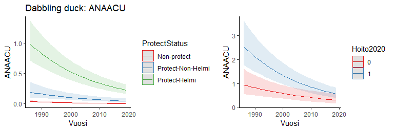
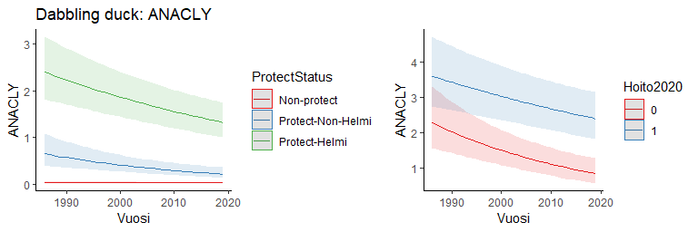
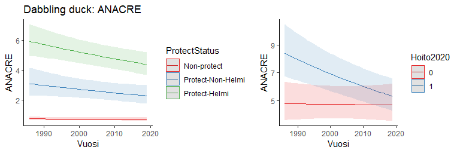
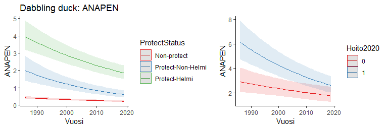
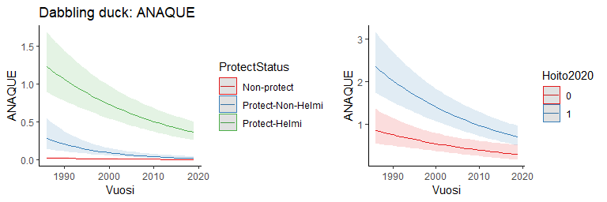
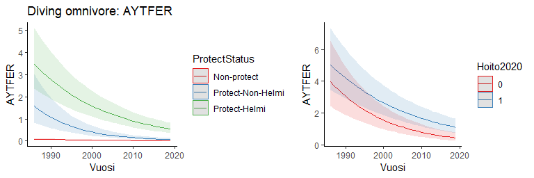
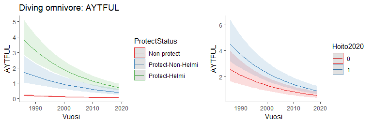
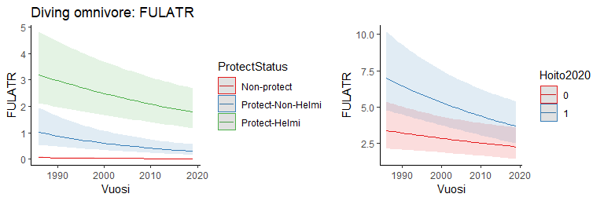
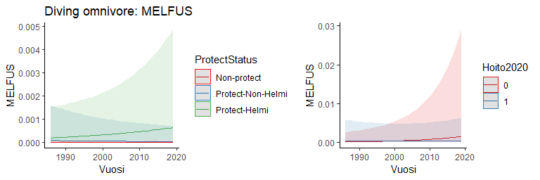

```r
library(glmmTMB)
library(ggplot2)
library(ggeffects)
library (MuMIn)
library(dplyr)
```


## The data

```r
mod.data = read.csv('data4model3.csv')
mod.data$NN = scale(mod.data$NNN)
mod.data$ProtectStatus = factor(mod.data$ProtectStatus, levels=c('Non-protect', 'Protect-Non-Helmi', 'Protect-Helmi'))

# species list
species = data.frame(species = colnames(mod.data[,10:45]),
                     tcount = colSums(mod.data[,10:45],na.rm = T), 
                     nobs = colSums(!is.na(mod.data[,10:45])))
guild = read.csv('guilds_20230804.csv')
species = merge(species, guild, by = 'species', all.x = T)

#Select the species with over 100 counted individuals and over 5000 observations
species = species[species$tcount>=100 & species$nobs>=5000,]
# 21 species left
species =
  species %>% mutate(Guild = recode(guild_name, 
                                       "dabbling ducks" = "Dabbling duck",
                                       "diving omnivores" = "Diving omnivore",
                                       "diving piscivores" = "Diving piscivore",
                                       "herons" = "Heron",
                                       .default = "Goose Swan")) 
summary(as.factor(species$Guild))
```

```
##    Dabbling duck  Diving omnivore Diving piscivore       Goose Swan 
##                6                6                6                2 
##            Heron 
##                1
```

```r
# 5 guilds

splist = species$species
splist
```

```
##  [1] "ANAACU" "ANACLY" "ANACRE" "ANAPEN" "ANAPLA" "ANAQUE" "AYTFER" "AYTFUL"
##  [9] "BOTSTE" "BRACAN" "BUCCLA" "CYGCYG" "FULATR" "GAVARC" "MELFUS" "MERALB"
## [17] "MERMER" "MERSER" "PODAUR" "PODCRI" "PODGRI"
```


## 1. Test the effect of protect status on waterbird abundance and population trends
## 2. Test the effect of restoration action before 2020 on waterbird abundance and population trends

```r
for (i in 1:length(splist)){
mod.data1 = mod.data[!is.na(mod.data[,splist[i]]),]
## 1. Test the effect of protect status on waterbird abundance and population trends
mod2=glmmTMB(get(splist[i])~
               ProtectStatus*scale(Vuosi)+
               poly(NN,2)+
               (1|SiteID), 
             data=mod.data1,family = nbinom2, REML=FALSE)
print(paste(species$Guild[i], splist[i], sep = ": "))
print(summary(mod2))
print(r.squaredGLMM(mod2))
dat2 = ggpredict(mod2, terms = c("Vuosi[all]","ProtectStatus"))
print(plot(dat2) + theme_classic() + 
  ylab(splist[i]) + ggtitle(paste(species$Guild[i], splist[i], sep = ": ")))


## 2. Test the effect of restoration action before 2020 on waterbird abundance and population trends
mod.data2 = mod.data1[mod.data1$ProtectStatus!='Non-protect',]
mod.data2$Hoito2020 = as.factor(mod.data2$Hoito2020)
mod3=glmmTMB(get(splist[i])~Hoito2020*scale(Vuosi)+
               poly(NN,2)+
               (1|SiteID), 
             data=mod.data2,family = nbinom2, REML=FALSE)
print(paste(species$Guild[i], splist[i], sep = ": "))
print(summary(mod3))
print(r.squaredGLMM(mod3))
dat3 = ggpredict(mod3, terms = c("Vuosi[all]","Hoito2020"))
print(plot(dat3) + theme_classic()+ 
  ylab(splist[i]) + ggtitle(paste(species$Guild[i], splist[i], sep = ": ")))
}
```

```
## [1] "Dabbling duck: ANAACU"
##  Family: nbinom2  ( log )
## Formula:          
## get(splist[i]) ~ ProtectStatus * scale(Vuosi) + poly(NN, 2) +      (1 | SiteID)
## Data: mod.data1
## 
##      AIC      BIC   logLik deviance df.resid 
##   5054.9   5120.7  -2517.5   5034.9     5280 
## 
## Random effects:
## 
## Conditional model:
##  Groups Name        Variance Std.Dev.
##  SiteID (Intercept) 3.056    1.748   
## Number of obs: 5290, groups:  SiteID, 886
## 
## Dispersion parameter for nbinom2 family (): 6.37 
## 
## Conditional model:
##                                             Estimate Std. Error z value
## (Intercept)                                  -4.8006     0.1925 -24.936
## ProtectStatusProtect-Non-Helmi                1.9303     0.2698   7.154
## ProtectStatusProtect-Helmi                    3.5542     0.2165  16.419
## scale(Vuosi)                                 -0.6603     0.0869  -7.599
## poly(NN, 2)1                                107.0746     6.4305  16.651
## poly(NN, 2)2                                -46.4494     6.4715  -7.178
## ProtectStatusProtect-Non-Helmi:scale(Vuosi)   0.1841     0.1430   1.288
## ProtectStatusProtect-Helmi:scale(Vuosi)       0.1752     0.1010   1.735
##                                             Pr(>|z|)    
## (Intercept)                                  < 2e-16 ***
## ProtectStatusProtect-Non-Helmi              8.43e-13 ***
## ProtectStatusProtect-Helmi                   < 2e-16 ***
## scale(Vuosi)                                2.99e-14 ***
## poly(NN, 2)1                                 < 2e-16 ***
## poly(NN, 2)2                                7.10e-13 ***
## ProtectStatusProtect-Non-Helmi:scale(Vuosi)   0.1978    
## ProtectStatusProtect-Helmi:scale(Vuosi)       0.0827 .  
## ---
## Signif. codes:  0 '***' 0.001 '**' 0.01 '*' 0.05 '.' 0.1 ' ' 1
##                 R2m       R2c
## delta     0.6272618 0.9809046
## lognormal 0.6281545 0.9823007
## trigamma  0.6262211 0.9792773
```

<!-- -->

```
## [1] "Dabbling duck: ANAACU"
##  Family: nbinom2  ( log )
## Formula:          
## get(splist[i]) ~ Hoito2020 * scale(Vuosi) + poly(NN, 2) + (1 |      SiteID)
## Data: mod.data2
## 
##      AIC      BIC   logLik deviance df.resid 
##   3448.5   3491.7  -1716.2   3432.5     1630 
## 
## Random effects:
## 
## Conditional model:
##  Groups Name        Variance Std.Dev.
##  SiteID (Intercept) 2.028    1.424   
## Number of obs: 1638, groups:  SiteID, 325
## 
## Dispersion parameter for nbinom2 family (): 8.29 
## 
## Conditional model:
##                          Estimate Std. Error z value Pr(>|z|)    
## (Intercept)              -2.04233    0.17045 -11.982  < 2e-16 ***
## Hoito20201                1.37935    0.20921   6.593 4.30e-11 ***
## scale(Vuosi)             -0.45738    0.08008  -5.711 1.12e-08 ***
## poly(NN, 2)1             58.97876    4.29003  13.748  < 2e-16 ***
## poly(NN, 2)2            -23.32815    3.78742  -6.159 7.30e-10 ***
## Hoito20201:scale(Vuosi)  -0.03389    0.09552  -0.355    0.723    
## ---
## Signif. codes:  0 '***' 0.001 '**' 0.01 '*' 0.05 '.' 0.1 ' ' 1
##                 R2m       R2c
## delta     0.6273024 0.9494075
## lognormal 0.6315171 0.9557863
## trigamma  0.6217695 0.9410335
```

<!-- -->

```
## [1] "Dabbling duck: ANACLY"
##  Family: nbinom2  ( log )
## Formula:          
## get(splist[i]) ~ ProtectStatus * scale(Vuosi) + poly(NN, 2) +      (1 | SiteID)
## Data: mod.data1
## 
##      AIC      BIC   logLik deviance df.resid 
##   9132.7   9198.8  -4556.3   9112.7     5498 
## 
## Random effects:
## 
## Conditional model:
##  Groups Name        Variance Std.Dev.
##  SiteID (Intercept) 3.115    1.765   
## Number of obs: 5508, groups:  SiteID, 929
## 
## Dispersion parameter for nbinom2 family ():  5.8 
## 
## Conditional model:
##                                              Estimate Std. Error z value
## (Intercept)                                  -3.27888    0.13336 -24.587
## ProtectStatusProtect-Non-Helmi                2.19912    0.22299   9.862
## ProtectStatusProtect-Helmi                    3.73646    0.17359  21.525
## scale(Vuosi)                                 -0.07786    0.06109  -1.275
## poly(NN, 2)1                                 16.54259    4.84523   3.414
## poly(NN, 2)2                                -11.34399    5.35839  -2.117
## ProtectStatusProtect-Non-Helmi:scale(Vuosi)  -0.26896    0.10666  -2.522
## ProtectStatusProtect-Helmi:scale(Vuosi)      -0.11536    0.07013  -1.645
##                                             Pr(>|z|)    
## (Intercept)                                  < 2e-16 ***
## ProtectStatusProtect-Non-Helmi               < 2e-16 ***
## ProtectStatusProtect-Helmi                   < 2e-16 ***
## scale(Vuosi)                                 0.20245    
## poly(NN, 2)1                                 0.00064 ***
## poly(NN, 2)2                                 0.03426 *  
## ProtectStatusProtect-Non-Helmi:scale(Vuosi)  0.01168 *  
## ProtectStatusProtect-Helmi:scale(Vuosi)      0.10001    
## ---
## Signif. codes:  0 '***' 0.001 '**' 0.01 '*' 0.05 '.' 0.1 ' ' 1
##                 R2m       R2c
## delta     0.4202341 0.9242876
## lognormal 0.4260290 0.9370332
## trigamma  0.4118460 0.9058383
```

<!-- -->

```
## [1] "Dabbling duck: ANACLY"
##  Family: nbinom2  ( log )
## Formula:          
## get(splist[i]) ~ Hoito2020 * scale(Vuosi) + poly(NN, 2) + (1 |      SiteID)
## Data: mod.data2
## 
##      AIC      BIC   logLik deviance df.resid 
##   6283.9   6328.0  -3133.9   6267.9     1821 
## 
## Random effects:
## 
## Conditional model:
##  Groups Name        Variance Std.Dev.
##  SiteID (Intercept) 1.802    1.342   
## Number of obs: 1829, groups:  SiteID, 363
## 
## Dispersion parameter for nbinom2 family (): 6.74 
## 
## Conditional model:
##                         Estimate Std. Error z value Pr(>|z|)    
## (Intercept)             -0.43010    0.11538  -3.728 0.000193 ***
## Hoito20201               1.23408    0.16467   7.494 6.67e-14 ***
## scale(Vuosi)            -0.34777    0.05317  -6.540 6.14e-11 ***
## poly(NN, 2)1             7.81554    3.10168   2.520 0.011743 *  
## poly(NN, 2)2            -8.47529    3.20183  -2.647 0.008121 ** 
## Hoito20201:scale(Vuosi)  0.20898    0.06445   3.243 0.001185 ** 
## ---
## Signif. codes:  0 '***' 0.001 '**' 0.01 '*' 0.05 '.' 0.1 ' ' 1
##                 R2m       R2c
## delta     0.2249865 0.8496312
## lognormal 0.2308649 0.8718303
## trigamma  0.2169250 0.8191882
```

<!-- -->

```
## [1] "Dabbling duck: ANACRE"
##  Family: nbinom2  ( log )
## Formula:          
## get(splist[i]) ~ ProtectStatus * scale(Vuosi) + poly(NN, 2) +      (1 | SiteID)
## Data: mod.data1
## 
##      AIC      BIC   logLik deviance df.resid 
##  20378.6  20445.1 -10179.3  20358.6     5713 
## 
## Random effects:
## 
## Conditional model:
##  Groups Name        Variance Std.Dev.
##  SiteID (Intercept) 1.198    1.094   
## Number of obs: 5723, groups:  SiteID, 991
## 
## Dispersion parameter for nbinom2 family (): 2.87 
## 
## Conditional model:
##                                             Estimate Std. Error z value
## (Intercept)                                 -0.38301    0.05579  -6.865
## ProtectStatusProtect-Non-Helmi               1.27698    0.11987  10.653
## ProtectStatusProtect-Helmi                   1.92384    0.09050  21.258
## scale(Vuosi)                                -0.01699    0.03216  -0.528
## poly(NN, 2)1                                22.49366    2.65524   8.471
## poly(NN, 2)2                                -8.68793    2.86710  -3.030
## ProtectStatusProtect-Non-Helmi:scale(Vuosi) -0.08143    0.06296  -1.293
## ProtectStatusProtect-Helmi:scale(Vuosi)     -0.08151    0.04417  -1.845
##                                             Pr(>|z|)    
## (Intercept)                                 6.64e-12 ***
## ProtectStatusProtect-Non-Helmi               < 2e-16 ***
## ProtectStatusProtect-Helmi                   < 2e-16 ***
## scale(Vuosi)                                 0.59734    
## poly(NN, 2)1                                 < 2e-16 ***
## poly(NN, 2)2                                 0.00244 ** 
## ProtectStatusProtect-Non-Helmi:scale(Vuosi)  0.19590    
## ProtectStatusProtect-Helmi:scale(Vuosi)      0.06501 .  
## ---
## Signif. codes:  0 '***' 0.001 '**' 0.01 '*' 0.05 '.' 0.1 ' ' 1
##                 R2m       R2c
## delta     0.3115986 0.7738237
## lognormal 0.3273655 0.8129792
## trigamma  0.2889236 0.7175126
```

<!-- -->

```
## [1] "Dabbling duck: ANACRE"
##  Family: nbinom2  ( log )
## Formula:          
## get(splist[i]) ~ Hoito2020 * scale(Vuosi) + poly(NN, 2) + (1 |      SiteID)
## Data: mod.data2
## 
##      AIC      BIC   logLik deviance df.resid 
##  10552.5  10597.4  -5268.3  10536.5     2011 
## 
## Random effects:
## 
## Conditional model:
##  Groups Name        Variance Std.Dev.
##  SiteID (Intercept) 0.9637   0.9817  
## Number of obs: 2019, groups:  SiteID, 419
## 
## Dispersion parameter for nbinom2 family (): 3.45 
## 
## Conditional model:
##                         Estimate Std. Error z value Pr(>|z|)    
## (Intercept)              1.09486    0.07283  15.033  < 2e-16 ***
## Hoito20201               0.59003    0.11106   5.313 1.08e-07 ***
## scale(Vuosi)            -0.04307    0.03462  -1.244  0.21348    
## poly(NN, 2)1            13.70837    2.18506   6.274 3.53e-10 ***
## poly(NN, 2)2            -6.05284    2.19028  -2.764  0.00572 ** 
## Hoito20201:scale(Vuosi) -0.11422    0.04823  -2.368  0.01788 *  
## ---
## Signif. codes:  0 '***' 0.001 '**' 0.01 '*' 0.05 '.' 0.1 ' ' 1
##                 R2m       R2c
## delta     0.1533523 0.7402543
## lognormal 0.1603115 0.7738470
## trigamma  0.1442620 0.6963738
```

<!-- -->

```
## [1] "Dabbling duck: ANAPEN"
##  Family: nbinom2  ( log )
## Formula:          
## get(splist[i]) ~ ProtectStatus * scale(Vuosi) + poly(NN, 2) +      (1 | SiteID)
## Data: mod.data1
## 
##      AIC      BIC   logLik deviance df.resid 
##  15961.9  16028.3  -7970.9  15941.9     5650 
## 
## Random effects:
## 
## Conditional model:
##  Groups Name        Variance Std.Dev.
##  SiteID (Intercept) 1.822    1.35    
## Number of obs: 5660, groups:  SiteID, 972
## 
## Dispersion parameter for nbinom2 family (): 3.67 
## 
## Conditional model:
##                                             Estimate Std. Error z value
## (Intercept)                                 -1.21163    0.07388 -16.400
## ProtectStatusProtect-Non-Helmi               1.27494    0.15222   8.376
## ProtectStatusProtect-Helmi                   2.17838    0.11467  18.998
## scale(Vuosi)                                -0.21804    0.03754  -5.808
## poly(NN, 2)1                                34.40583    3.27995  10.490
## poly(NN, 2)2                                -2.16354    3.56564  -0.607
## ProtectStatusProtect-Non-Helmi:scale(Vuosi) -0.16789    0.07271  -2.309
## ProtectStatusProtect-Helmi:scale(Vuosi)     -0.02907    0.04970  -0.585
##                                             Pr(>|z|)    
## (Intercept)                                  < 2e-16 ***
## ProtectStatusProtect-Non-Helmi               < 2e-16 ***
## ProtectStatusProtect-Helmi                   < 2e-16 ***
## scale(Vuosi)                                6.31e-09 ***
## poly(NN, 2)1                                 < 2e-16 ***
## poly(NN, 2)2                                  0.5440    
## ProtectStatusProtect-Non-Helmi:scale(Vuosi)   0.0209 *  
## ProtectStatusProtect-Helmi:scale(Vuosi)       0.5587    
## ---
## Signif. codes:  0 '***' 0.001 '**' 0.01 '*' 0.05 '.' 0.1 ' ' 1
##                 R2m       R2c
## delta     0.3291757 0.8418996
## lognormal 0.3402804 0.8703011
## trigamma  0.3128186 0.8000647
```

<!-- -->

```
## [1] "Dabbling duck: ANAPEN"
##  Family: nbinom2  ( log )
## Formula:          
## get(splist[i]) ~ Hoito2020 * scale(Vuosi) + poly(NN, 2) + (1 |      SiteID)
## Data: mod.data2
## 
##      AIC      BIC   logLik deviance df.resid 
##   8560.1   8604.8  -4272.1   8544.1     1956 
## 
## Random effects:
## 
## Conditional model:
##  Groups Name        Variance Std.Dev.
##  SiteID (Intercept) 1.341    1.158   
## Number of obs: 1964, groups:  SiteID, 401
## 
## Dispersion parameter for nbinom2 family (): 4.76 
## 
## Conditional model:
##                         Estimate Std. Error z value Pr(>|z|)    
## (Intercept)              0.35094    0.08962   3.916 9.01e-05 ***
## Hoito20201               0.88006    0.13328   6.603 4.03e-11 ***
## scale(Vuosi)            -0.25036    0.03943  -6.349 2.17e-10 ***
## poly(NN, 2)1            20.65670    2.58214   8.000 1.25e-15 ***
## poly(NN, 2)2            -4.71503    2.56403  -1.839   0.0659 .  
## Hoito20201:scale(Vuosi) -0.04218    0.05220  -0.808   0.4191    
## ---
## Signif. codes:  0 '***' 0.001 '**' 0.01 '*' 0.05 '.' 0.1 ' ' 1
##                 R2m       R2c
## delta     0.2528907 0.8340066
## lognormal 0.2595002 0.8558040
## trigamma  0.2441604 0.8052150
```

<!-- -->

```
## [1] "Dabbling duck: ANAPLA"
##  Family: nbinom2  ( log )
## Formula:          
## get(splist[i]) ~ ProtectStatus * scale(Vuosi) + poly(NN, 2) +      (1 | SiteID)
## Data: mod.data1
## 
##      AIC      BIC   logLik deviance df.resid 
##  22813.0  22879.5 -11396.5  22793.0     5734 
## 
## Random effects:
## 
## Conditional model:
##  Groups Name        Variance Std.Dev.
##  SiteID (Intercept) 1.176    1.084   
## Number of obs: 5744, groups:  SiteID, 989
## 
## Dispersion parameter for nbinom2 family (): 5.84 
## 
## Conditional model:
##                                             Estimate Std. Error z value
## (Intercept)                                  0.12982    0.05161   2.515
## ProtectStatusProtect-Non-Helmi               0.90723    0.11407   7.954
## ProtectStatusProtect-Helmi                   1.63637    0.08605  19.016
## scale(Vuosi)                                 0.06744    0.02557   2.638
## poly(NN, 2)1                                -9.36910    2.56078  -3.659
## poly(NN, 2)2                                 8.62069    2.76046   3.123
## ProtectStatusProtect-Non-Helmi:scale(Vuosi) -0.12453    0.05093  -2.445
## ProtectStatusProtect-Helmi:scale(Vuosi)     -0.06085    0.03482  -1.747
##                                             Pr(>|z|)    
## (Intercept)                                 0.011896 *  
## ProtectStatusProtect-Non-Helmi              1.81e-15 ***
## ProtectStatusProtect-Helmi                   < 2e-16 ***
## scale(Vuosi)                                0.008342 ** 
## poly(NN, 2)1                                0.000254 ***
## poly(NN, 2)2                                0.001791 ** 
## ProtectStatusProtect-Non-Helmi:scale(Vuosi) 0.014477 *  
## ProtectStatusProtect-Helmi:scale(Vuosi)     0.080592 .  
## ---
## Signif. codes:  0 '***' 0.001 '**' 0.01 '*' 0.05 '.' 0.1 ' ' 1
##                 R2m       R2c
## delta     0.2531847 0.8189280
## lognormal 0.2603112 0.8419789
## trigamma  0.2438630 0.7887769
```

<!-- -->

```
## [1] "Dabbling duck: ANAPLA"
##  Family: nbinom2  ( log )
## Formula:          
## get(splist[i]) ~ Hoito2020 * scale(Vuosi) + poly(NN, 2) + (1 |      SiteID)
## Data: mod.data2
## 
##      AIC      BIC   logLik deviance df.resid 
##  11011.2  11056.1  -5497.6  10995.2     2033 
## 
## Random effects:
## 
## Conditional model:
##  Groups Name        Variance Std.Dev.
##  SiteID (Intercept) 1.216    1.103   
## Number of obs: 2041, groups:  SiteID, 418
## 
## Dispersion parameter for nbinom2 family (): 6.86 
## 
## Conditional model:
##                          Estimate Std. Error z value Pr(>|z|)    
## (Intercept)              1.256987   0.077755  16.166  < 2e-16 ***
## Hoito20201               0.653460   0.119651   5.461 4.72e-08 ***
## scale(Vuosi)            -0.005975   0.028336  -0.211   0.8330    
## poly(NN, 2)1            -5.014861   2.371627  -2.115   0.0345 *  
## poly(NN, 2)2             1.731593   2.399823   0.722   0.4706    
## Hoito20201:scale(Vuosi) -0.014066   0.038933  -0.361   0.7179    
## ---
## Signif. codes:  0 '***' 0.001 '**' 0.01 '*' 0.05 '.' 0.1 ' ' 1
##                  R2m       R2c
## delta     0.06634427 0.8352708
## lognormal 0.06758350 0.8508726
## trigamma  0.06483364 0.8162519
```

<!-- -->

```
## [1] "Dabbling duck: ANAQUE"
##  Family: nbinom2  ( log )
## Formula:          
## get(splist[i]) ~ ProtectStatus * scale(Vuosi) + poly(NN, 2) +      (1 | SiteID)
## Data: mod.data1
## 
##      AIC      BIC   logLik deviance df.resid 
##   5163.1   5229.0  -2571.5   5143.1     5357 
## 
## Random effects:
## 
## Conditional model:
##  Groups Name        Variance Std.Dev.
##  SiteID (Intercept) 3.072    1.753   
## Number of obs: 5367, groups:  SiteID, 890
## 
## Dispersion parameter for nbinom2 family (): 7.42 
## 
## Conditional model:
##                                             Estimate Std. Error z value
## (Intercept)                                 -4.42015    0.18278 -24.183
## ProtectStatusProtect-Non-Helmi               1.75909    0.27625   6.368
## ProtectStatusProtect-Helmi                   3.90965    0.21201  18.441
## scale(Vuosi)                                -0.42327    0.09459  -4.475
## poly(NN, 2)1                                 6.08253    5.81084   1.047
## poly(NN, 2)2                                -9.49615    6.42083  -1.479
## ProtectStatusProtect-Non-Helmi:scale(Vuosi) -0.41663    0.18488  -2.254
## ProtectStatusProtect-Helmi:scale(Vuosi)      0.02375    0.10601   0.224
##                                             Pr(>|z|)    
## (Intercept)                                  < 2e-16 ***
## ProtectStatusProtect-Non-Helmi              1.92e-10 ***
## ProtectStatusProtect-Helmi                   < 2e-16 ***
## scale(Vuosi)                                7.66e-06 ***
## poly(NN, 2)1                                  0.2952    
## poly(NN, 2)2                                  0.1392    
## ProtectStatusProtect-Non-Helmi:scale(Vuosi)   0.0242 *  
## ProtectStatusProtect-Helmi:scale(Vuosi)       0.8227    
## ---
## Signif. codes:  0 '***' 0.001 '**' 0.01 '*' 0.05 '.' 0.1 ' ' 1
##                 R2m       R2c
## delta     0.4387070 0.9067053
## lognormal 0.4478967 0.9256983
## trigamma  0.4242635 0.8768538
```

<!-- -->

```
## [1] "Dabbling duck: ANAQUE"
##  Family: nbinom2  ( log )
## Formula:          
## get(splist[i]) ~ Hoito2020 * scale(Vuosi) + poly(NN, 2) + (1 |      SiteID)
## Data: mod.data2
## 
##      AIC      BIC   logLik deviance df.resid 
##   3742.8   3786.3  -1863.4   3726.8     1697 
## 
## Random effects:
## 
## Conditional model:
##  Groups Name        Variance Std.Dev.
##  SiteID (Intercept) 1.548    1.244   
## Number of obs: 1705, groups:  SiteID, 331
## 
## Dispersion parameter for nbinom2 family (): 7.82 
## 
## Conditional model:
##                         Estimate Std. Error z value Pr(>|z|)    
## (Intercept)             -1.62555    0.13748 -11.824  < 2e-16 ***
## Hoito20201               1.57550    0.18074   8.717  < 2e-16 ***
## scale(Vuosi)            -0.58280    0.08894  -6.552 5.66e-11 ***
## poly(NN, 2)1             6.29191    3.31302   1.899  0.05754 .  
## poly(NN, 2)2            -9.66321    3.50554  -2.757  0.00584 ** 
## Hoito20201:scale(Vuosi)  0.18362    0.10214   1.798  0.07222 .  
## ---
## Signif. codes:  0 '***' 0.001 '**' 0.01 '*' 0.05 '.' 0.1 ' ' 1
##                 R2m       R2c
## delta     0.3233149 0.7538987
## lognormal 0.3475831 0.8104868
## trigamma  0.2842277 0.6627560
```

<!-- -->

```
## [1] "Diving omnivore: AYTFER"
##  Family: nbinom2  ( log )
## Formula:          
## get(splist[i]) ~ ProtectStatus * scale(Vuosi) + poly(NN, 2) +      (1 | SiteID)
## Data: mod.data1
## 
##      AIC      BIC   logLik deviance df.resid 
##   7865.9   7931.7  -3923.0   7845.9     5317 
## 
## Random effects:
## 
## Conditional model:
##  Groups Name        Variance Std.Dev.
##  SiteID (Intercept) 4.124    2.031   
## Number of obs: 5327, groups:  SiteID, 870
## 
## Dispersion parameter for nbinom2 family (): 3.43 
## 
## Conditional model:
##                                              Estimate Std. Error z value
## (Intercept)                                  -3.96577    0.17897 -22.159
## ProtectStatusProtect-Non-Helmi                2.14404    0.28781   7.449
## ProtectStatusProtect-Helmi                    3.62745    0.22155  16.373
## scale(Vuosi)                                 -0.54939    0.07125  -7.710
## poly(NN, 2)1                                -77.47413   12.17428  -6.364
## poly(NN, 2)2                                -66.95381   11.15036  -6.005
## ProtectStatusProtect-Non-Helmi:scale(Vuosi)  -0.51347    0.14520  -3.536
## ProtectStatusProtect-Helmi:scale(Vuosi)      -0.06348    0.08818  -0.720
##                                             Pr(>|z|)    
## (Intercept)                                  < 2e-16 ***
## ProtectStatusProtect-Non-Helmi              9.38e-14 ***
## ProtectStatusProtect-Helmi                   < 2e-16 ***
## scale(Vuosi)                                1.25e-14 ***
## poly(NN, 2)1                                1.97e-10 ***
## poly(NN, 2)2                                1.92e-09 ***
## ProtectStatusProtect-Non-Helmi:scale(Vuosi) 0.000406 ***
## ProtectStatusProtect-Helmi:scale(Vuosi)     0.471583    
## ---
## Signif. codes:  0 '***' 0.001 '**' 0.01 '*' 0.05 '.' 0.1 ' ' 1
##                 R2m       R2c
## delta     0.5082412 0.9491891
## lognormal 0.5129810 0.9580410
## trigamma  0.5012681 0.9361662
```

<!-- -->

```
## [1] "Diving omnivore: AYTFER"
##  Family: nbinom2  ( log )
## Formula:          
## get(splist[i]) ~ Hoito2020 * scale(Vuosi) + poly(NN, 2) + (1 |      SiteID)
## Data: mod.data2
## 
##      AIC      BIC   logLik deviance df.resid 
##   5000.5   5043.8  -2492.3   4984.5     1647 
## 
## Random effects:
## 
## Conditional model:
##  Groups Name        Variance Std.Dev.
##  SiteID (Intercept) 2.443    1.563   
## Number of obs: 1655, groups:  SiteID, 309
## 
## Dispersion parameter for nbinom2 family (): 3.92 
## 
## Conditional model:
##                          Estimate Std. Error z value Pr(>|z|)    
## (Intercept)              -0.97129    0.15320  -6.340 2.29e-10 ***
## Hoito20201                1.05579    0.21853   4.831 1.36e-06 ***
## scale(Vuosi)             -0.86863    0.07039 -12.340  < 2e-16 ***
## poly(NN, 2)1            -24.40045    5.06841  -4.814 1.48e-06 ***
## poly(NN, 2)2            -38.26657    5.87396  -6.515 7.29e-11 ***
## Hoito20201:scale(Vuosi)   0.35153    0.09214   3.815 0.000136 ***
## ---
## Signif. codes:  0 '***' 0.001 '**' 0.01 '*' 0.05 '.' 0.1 ' ' 1
##                 R2m       R2c
## delta     0.4234279 0.8951104
## lognormal 0.4325611 0.9144178
## trigamma  0.4097458 0.8661871
```

<!-- -->

```
## [1] "Diving omnivore: AYTFUL"
##  Family: nbinom2  ( log )
## Formula:          
## get(splist[i]) ~ ProtectStatus * scale(Vuosi) + poly(NN, 2) +      (1 | SiteID)
## Data: mod.data1
## 
##      AIC      BIC   logLik deviance df.resid 
##  14246.5  14313.1  -7113.2  14226.5     5760 
## 
## Random effects:
## 
## Conditional model:
##  Groups Name        Variance Std.Dev.
##  SiteID (Intercept) 3.743    1.935   
## Number of obs: 5770, groups:  SiteID, 994
## 
## Dispersion parameter for nbinom2 family ():  1.8 
## 
## Conditional model:
##                                             Estimate Std. Error z value
## (Intercept)                                 -2.28337    0.11829 -19.304
## ProtectStatusProtect-Non-Helmi               2.00831    0.21660   9.272
## ProtectStatusProtect-Helmi                   2.68981    0.16763  16.046
## scale(Vuosi)                                -0.42368    0.05360  -7.905
## poly(NN, 2)1                                57.08462    4.78574  11.928
## poly(NN, 2)2                                -7.15996    5.20041  -1.377
## ProtectStatusProtect-Non-Helmi:scale(Vuosi) -0.04147    0.09459  -0.438
## ProtectStatusProtect-Helmi:scale(Vuosi)     -0.11508    0.07064  -1.629
##                                             Pr(>|z|)    
## (Intercept)                                  < 2e-16 ***
## ProtectStatusProtect-Non-Helmi               < 2e-16 ***
## ProtectStatusProtect-Helmi                   < 2e-16 ***
## scale(Vuosi)                                2.69e-15 ***
## poly(NN, 2)1                                 < 2e-16 ***
## poly(NN, 2)2                                   0.169    
## ProtectStatusProtect-Non-Helmi:scale(Vuosi)    0.661    
## ProtectStatusProtect-Helmi:scale(Vuosi)        0.103    
## ---
## Signif. codes:  0 '***' 0.001 '**' 0.01 '*' 0.05 '.' 0.1 ' ' 1
##                 R2m       R2c
## delta     0.3392623 0.8959344
## lognormal 0.3480236 0.9190716
## trigamma  0.3248827 0.8579604
```

<!-- -->

```
## [1] "Diving omnivore: AYTFUL"
##  Family: nbinom2  ( log )
## Formula:          
## get(splist[i]) ~ Hoito2020 * scale(Vuosi) + poly(NN, 2) + (1 |      SiteID)
## Data: mod.data2
## 
##      AIC      BIC   logLik deviance df.resid 
##   8581.8   8626.8  -4282.9   8565.8     2052 
## 
## Random effects:
## 
## Conditional model:
##  Groups Name        Variance Std.Dev.
##  SiteID (Intercept) 2.362    1.537   
## Number of obs: 2060, groups:  SiteID, 422
## 
## Dispersion parameter for nbinom2 family (): 1.88 
## 
## Conditional model:
##                         Estimate Std. Error z value Pr(>|z|)    
## (Intercept)              0.04748    0.11810   0.402 0.687649    
## Hoito20201               0.65078    0.17494   3.720 0.000199 ***
## scale(Vuosi)            -0.46935    0.05259  -8.925  < 2e-16 ***
## poly(NN, 2)1            34.99851    3.49157  10.024  < 2e-16 ***
## poly(NN, 2)2            -5.84446    3.46401  -1.687 0.091566 .  
## Hoito20201:scale(Vuosi) -0.04618    0.07405  -0.624 0.532845    
## ---
## Signif. codes:  0 '***' 0.001 '**' 0.01 '*' 0.05 '.' 0.1 ' ' 1
##                 R2m       R2c
## delta     0.2564642 0.8369509
## lognormal 0.2665908 0.8699984
## trigamma  0.2407616 0.7857066
```

<!-- -->

```
## [1] "Heron: BOTSTE"
##  Family: nbinom2  ( log )
## Formula:          
## get(splist[i]) ~ ProtectStatus * scale(Vuosi) + poly(NN, 2) +      (1 | SiteID)
## Data: mod.data1
## 
##      AIC      BIC   logLik deviance df.resid 
##   2673.5   2739.2  -1326.8   2653.5     5263 
## 
## Random effects:
## 
## Conditional model:
##  Groups Name        Variance Std.Dev.
##  SiteID (Intercept) 3.469    1.862   
## Number of obs: 5273, groups:  SiteID, 873
## 
## Dispersion parameter for nbinom2 family (): 3.7e+08 
## 
## Conditional model:
##                                             Estimate Std. Error z value
## (Intercept)                                  -5.7253     0.3154 -18.151
## ProtectStatusProtect-Non-Helmi                1.7392     0.4147   4.194
## ProtectStatusProtect-Helmi                    4.1550     0.3142  13.223
## scale(Vuosi)                                  1.4672     0.2205   6.654
## poly(NN, 2)1                                -36.4668    11.1908  -3.259
## poly(NN, 2)2                                 -8.0426    10.4570  -0.769
## ProtectStatusProtect-Non-Helmi:scale(Vuosi)  -0.3200     0.3085  -1.037
## ProtectStatusProtect-Helmi:scale(Vuosi)      -0.8610     0.2354  -3.658
##                                             Pr(>|z|)    
## (Intercept)                                  < 2e-16 ***
## ProtectStatusProtect-Non-Helmi              2.75e-05 ***
## ProtectStatusProtect-Helmi                   < 2e-16 ***
## scale(Vuosi)                                2.85e-11 ***
## poly(NN, 2)1                                0.001119 ** 
## poly(NN, 2)2                                0.441829    
## ProtectStatusProtect-Non-Helmi:scale(Vuosi) 0.299571    
## ProtectStatusProtect-Helmi:scale(Vuosi)     0.000254 ***
## ---
## Signif. codes:  0 '***' 0.001 '**' 0.01 '*' 0.05 '.' 0.1 ' ' 1
##                 R2m       R2c
## delta     0.5776299 0.9986015
## lognormal 0.5776345 0.9986095
## trigamma  0.5776253 0.9985934
```

<!-- -->

```
## [1] "Heron: BOTSTE"
##  Family: nbinom2  ( log )
## Formula:          
## get(splist[i]) ~ Hoito2020 * scale(Vuosi) + poly(NN, 2) + (1 |      SiteID)
## Data: mod.data2
## 
##      AIC      BIC   logLik deviance df.resid 
##   1881.0   1924.2   -932.5   1865.0     1624 
## 
## Random effects:
## 
## Conditional model:
##  Groups Name        Variance Std.Dev.
##  SiteID (Intercept) 2.821    1.68    
## Number of obs: 1632, groups:  SiteID, 316
## 
## Dispersion parameter for nbinom2 family (): 9.96e+05 
## 
## Conditional model:
##                         Estimate Std. Error z value Pr(>|z|)    
## (Intercept)              -2.5587     0.2004 -12.766  < 2e-16 ***
## Hoito20201                1.1287     0.2639   4.276 1.90e-05 ***
## scale(Vuosi)              0.7222     0.1013   7.127 1.03e-12 ***
## poly(NN, 2)1            -17.1006     5.8166  -2.940  0.00328 ** 
## poly(NN, 2)2            -11.5553     6.5738  -1.758  0.07879 .  
## Hoito20201:scale(Vuosi)  -0.1295     0.1361  -0.951  0.34136    
## ---
## Signif. codes:  0 '***' 0.001 '**' 0.01 '*' 0.05 '.' 0.1 ' ' 1
##                 R2m       R2c
## delta     0.1969343 0.7695756
## lognormal 0.2132351 0.8332753
## trigamma  0.1679508 0.6563143
```

<!-- -->

```
## [1] "Goose Swan: BRACAN"
##  Family: nbinom2  ( log )
## Formula:          
## get(splist[i]) ~ ProtectStatus * scale(Vuosi) + poly(NN, 2) +      (1 | SiteID)
## Data: mod.data1
## 
##      AIC      BIC   logLik deviance df.resid 
##       NA       NA       NA       NA     5084 
## 
## Random effects:
## 
## Conditional model:
##  Groups Name        Variance Std.Dev.
##  SiteID (Intercept) 5.619    2.37    
## Number of obs: 5094, groups:  SiteID, 808
## 
## Dispersion parameter for nbinom2 family (): 9.79e+15 
## 
## Conditional model:
##                                              Estimate Std. Error z value
## (Intercept)                                  -6.23364        NaN     NaN
## ProtectStatusProtect-Non-Helmi                1.50519    0.34800   4.325
## ProtectStatusProtect-Helmi                    2.86835        NaN     NaN
## scale(Vuosi)                                  0.98635    0.04838  20.386
## poly(NN, 2)1                                -42.65150        NaN     NaN
## poly(NN, 2)2                                 34.77979        NaN     NaN
## ProtectStatusProtect-Non-Helmi:scale(Vuosi)  -0.21008    0.25315  -0.830
## ProtectStatusProtect-Helmi:scale(Vuosi)      -0.24814        NaN     NaN
##                                             Pr(>|z|)    
## (Intercept)                                      NaN    
## ProtectStatusProtect-Non-Helmi              1.52e-05 ***
## ProtectStatusProtect-Helmi                       NaN    
## scale(Vuosi)                                 < 2e-16 ***
## poly(NN, 2)1                                     NaN    
## poly(NN, 2)2                                     NaN    
## ProtectStatusProtect-Non-Helmi:scale(Vuosi)    0.407    
## ProtectStatusProtect-Helmi:scale(Vuosi)          NaN    
## ---
## Signif. codes:  0 '***' 0.001 '**' 0.01 '*' 0.05 '.' 0.1 ' ' 1
##                 R2m       R2c
## delta     0.3227809 0.9999677
## lognormal 0.3227809 0.9999677
## trigamma  0.3227809 0.9999677
```

<!-- -->

```
## [1] "Goose Swan: BRACAN"
##  Family: nbinom2  ( log )
## Formula:          
## get(splist[i]) ~ Hoito2020 * scale(Vuosi) + poly(NN, 2) + (1 |      SiteID)
## Data: mod.data2
## 
##      AIC      BIC   logLik deviance df.resid 
##    986.8   1029.1   -485.4    970.8     1448 
## 
## Random effects:
## 
## Conditional model:
##  Groups Name        Variance Std.Dev.
##  SiteID (Intercept) 4.856    2.204   
## Number of obs: 1456, groups:  SiteID, 254
## 
## Dispersion parameter for nbinom2 family (): 1.81e+07 
## 
## Conditional model:
##                         Estimate Std. Error z value Pr(>|z|)    
## (Intercept)              -4.0885     0.3684 -11.097  < 2e-16 ***
## Hoito20201                0.9079     0.4300   2.112  0.03473 *  
## scale(Vuosi)              0.4044     0.1683   2.402  0.01630 *  
## poly(NN, 2)1            -26.5819     8.3562  -3.181  0.00147 ** 
## poly(NN, 2)2              0.9669     9.3911   0.103  0.91799    
## Hoito20201:scale(Vuosi)   0.8871     0.2809   3.158  0.00159 ** 
## ---
## Signif. codes:  0 '***' 0.001 '**' 0.01 '*' 0.05 '.' 0.1 ' ' 1
##                 R2m       R2c
## delta     0.1568898 0.8361305
## lognormal 0.1660916 0.8851705
## trigamma  0.1391615 0.7416491
```

<!-- -->

```
## [1] "Diving omnivore: BUCCLA"
##  Family: nbinom2  ( log )
## Formula:          
## get(splist[i]) ~ ProtectStatus * scale(Vuosi) + poly(NN, 2) +      (1 | SiteID)
## Data: mod.data1
## 
##      AIC      BIC   logLik deviance df.resid 
##  23697.2  23763.7 -11838.6  23677.2     5700 
## 
## Random effects:
## 
## Conditional model:
##  Groups Name        Variance Std.Dev.
##  SiteID (Intercept) 1.263    1.124   
## Number of obs: 5710, groups:  SiteID, 988
## 
## Dispersion parameter for nbinom2 family (): 6.26 
## 
## Conditional model:
##                                             Estimate Std. Error z value
## (Intercept)                                  0.33294    0.05263   6.326
## ProtectStatusProtect-Non-Helmi               0.88578    0.11544   7.673
## ProtectStatusProtect-Helmi                   1.12332    0.08879  12.651
## scale(Vuosi)                                 0.08003    0.02445   3.273
## poly(NN, 2)1                                10.14172    2.57009   3.946
## poly(NN, 2)2                                 6.18426    2.77797   2.226
## ProtectStatusProtect-Non-Helmi:scale(Vuosi) -0.02570    0.04774  -0.538
## ProtectStatusProtect-Helmi:scale(Vuosi)      0.05724    0.03521   1.626
##                                             Pr(>|z|)    
## (Intercept)                                 2.51e-10 ***
## ProtectStatusProtect-Non-Helmi              1.68e-14 ***
## ProtectStatusProtect-Helmi                   < 2e-16 ***
## scale(Vuosi)                                 0.00106 ** 
## poly(NN, 2)1                                7.94e-05 ***
## poly(NN, 2)2                                 0.02600 *  
## ProtectStatusProtect-Non-Helmi:scale(Vuosi)  0.59037    
## ProtectStatusProtect-Helmi:scale(Vuosi)      0.10405    
## ---
## Signif. codes:  0 '***' 0.001 '**' 0.01 '*' 0.05 '.' 0.1 ' ' 1
##                 R2m       R2c
## delta     0.1476950 0.8100977
## lognormal 0.1519241 0.8332941
## trigamma  0.1422281 0.7801119
```

<!-- -->

```
## [1] "Diving omnivore: BUCCLA"
##  Family: nbinom2  ( log )
## Formula:          
## get(splist[i]) ~ Hoito2020 * scale(Vuosi) + poly(NN, 2) + (1 |      SiteID)
## Data: mod.data2
## 
##      AIC      BIC   logLik deviance df.resid 
##  10689.6  10734.5  -5336.8  10673.6     2003 
## 
## Random effects:
## 
## Conditional model:
##  Groups Name        Variance Std.Dev.
##  SiteID (Intercept) 1.25     1.118   
## Number of obs: 2011, groups:  SiteID, 416
## 
## Dispersion parameter for nbinom2 family (): 6.06 
## 
## Conditional model:
##                         Estimate Std. Error z value Pr(>|z|)    
## (Intercept)              1.25268    0.07952  15.752  < 2e-16 ***
## Hoito20201               0.31948    0.12293   2.599  0.00935 ** 
## scale(Vuosi)             0.06088    0.02829   2.152  0.03138 *  
## poly(NN, 2)1             3.90366    2.38019   1.640  0.10099    
## poly(NN, 2)2             2.90230    2.39126   1.214  0.22486    
## Hoito20201:scale(Vuosi)  0.11126    0.04273   2.604  0.00923 ** 
## ---
## Signif. codes:  0 '***' 0.001 '**' 0.01 '*' 0.05 '.' 0.1 ' ' 1
##                  R2m       R2c
## delta     0.03172831 0.8173159
## lognormal 0.03245246 0.8359698
## trigamma  0.03083182 0.7942223
```

<!-- -->

```
## [1] "Goose Swan: CYGCYG"
##  Family: nbinom2  ( log )
## Formula:          
## get(splist[i]) ~ ProtectStatus * scale(Vuosi) + poly(NN, 2) +      (1 | SiteID)
## Data: mod.data1
## 
##      AIC      BIC   logLik deviance df.resid 
##       NA       NA       NA       NA     5413 
## 
## Random effects:
## 
## Conditional model:
##  Groups Name        Variance Std.Dev.
##  SiteID (Intercept) 0.9639   0.9818  
## Number of obs: 5423, groups:  SiteID, 951
## 
## Dispersion parameter for nbinom2 family (): 1.05e+07 
## 
## Conditional model:
##                                               Estimate Std. Error z value
## (Intercept)                                 -2.2684665  0.0781880 -29.013
## ProtectStatusProtect-Non-Helmi               1.0065335  0.1461228   6.888
## ProtectStatusProtect-Helmi                   1.5938435  0.1086009  14.676
## scale(Vuosi)                                 0.7875869  0.0580308  13.572
## poly(NN, 2)1                                21.0441206  3.0201838   6.968
## poly(NN, 2)2                                -8.5986343  3.2441885  -2.650
## ProtectStatusProtect-Non-Helmi:scale(Vuosi) -0.1830007  0.1076135  -1.701
## ProtectStatusProtect-Helmi:scale(Vuosi)     -0.0002503  0.0766840  -0.003
##                                             Pr(>|z|)    
## (Intercept)                                  < 2e-16 ***
## ProtectStatusProtect-Non-Helmi              5.65e-12 ***
## ProtectStatusProtect-Helmi                   < 2e-16 ***
## scale(Vuosi)                                 < 2e-16 ***
## poly(NN, 2)1                                3.22e-12 ***
## poly(NN, 2)2                                 0.00804 ** 
## ProtectStatusProtect-Non-Helmi:scale(Vuosi)  0.08903 .  
## ProtectStatusProtect-Helmi:scale(Vuosi)      0.99740    
## ---
## Signif. codes:  0 '***' 0.001 '**' 0.01 '*' 0.05 '.' 0.1 ' ' 1
##                 R2m       R2c
## delta     0.2769783 0.5241325
## lognormal 0.3491905 0.6607813
## trigamma  0.1689905 0.3197846
```

<!-- -->

```
## [1] "Goose Swan: CYGCYG"
##  Family: nbinom2  ( log )
## Formula:          
## get(splist[i]) ~ Hoito2020 * scale(Vuosi) + poly(NN, 2) + (1 |      SiteID)
## Data: mod.data2
## 
##      AIC      BIC   logLik deviance df.resid 
##       NA       NA       NA       NA     1754 
## 
## Random effects:
## 
## Conditional model:
##  Groups Name        Variance Std.Dev.
##  SiteID (Intercept) 0.7687   0.8767  
## Number of obs: 1762, groups:  SiteID, 382
## 
## Dispersion parameter for nbinom2 family (): 2.59e+07 
## 
## Conditional model:
##                         Estimate Std. Error z value Pr(>|z|)    
## (Intercept)             -0.97391    0.09205 -10.580  < 2e-16 ***
## Hoito20201               0.28063    0.13188   2.128  0.03335 *  
## scale(Vuosi)             0.67207    0.06118  10.986  < 2e-16 ***
## poly(NN, 2)1            15.25609    2.29308   6.653 2.87e-11 ***
## poly(NN, 2)2            -5.95104    2.26182  -2.631  0.00851 ** 
## Hoito20201:scale(Vuosi)  0.10120    0.08617   1.174  0.24024    
## ---
## Signif. codes:  0 '***' 0.001 '**' 0.01 '*' 0.05 '.' 0.1 ' ' 1
##                 R2m       R2c
## delta     0.2760456 0.5863368
## lognormal 0.3168908 0.6730944
## trigamma  0.2165782 0.4600246
```

<!-- -->

```
## [1] "Diving omnivore: FULATR"
##  Family: nbinom2  ( log )
## Formula:          
## get(splist[i]) ~ ProtectStatus * scale(Vuosi) + poly(NN, 2) +      (1 | SiteID)
## Data: mod.data1
## 
##      AIC      BIC   logLik deviance df.resid 
##  12587.3  12653.3  -6283.7  12567.3     5430 
## 
## Random effects:
## 
## Conditional model:
##  Groups Name        Variance Std.Dev.
##  SiteID (Intercept) 6.35     2.52    
## Number of obs: 5440, groups:  SiteID, 897
## 
## Dispersion parameter for nbinom2 family (): 2.56 
## 
## Conditional model:
##                                               Estimate Std. Error z value
## (Intercept)                                  -3.712262   0.195180 -19.020
## ProtectStatusProtect-Non-Helmi                2.842772   0.315454   9.012
## ProtectStatusProtect-Helmi                    4.306934   0.245637  17.534
## scale(Vuosi)                                 -0.405472   0.058288  -6.956
## poly(NN, 2)1                                -83.522344  10.773337  -7.753
## poly(NN, 2)2                                -28.102330  10.372630  -2.709
## ProtectStatusProtect-Non-Helmi:scale(Vuosi)   0.007359   0.111971   0.066
## ProtectStatusProtect-Helmi:scale(Vuosi)       0.213473   0.071205   2.998
##                                             Pr(>|z|)    
## (Intercept)                                  < 2e-16 ***
## ProtectStatusProtect-Non-Helmi               < 2e-16 ***
## ProtectStatusProtect-Helmi                   < 2e-16 ***
## scale(Vuosi)                                3.49e-12 ***
## poly(NN, 2)1                                9.00e-15 ***
## poly(NN, 2)2                                 0.00674 ** 
## ProtectStatusProtect-Non-Helmi:scale(Vuosi)  0.94760    
## ProtectStatusProtect-Helmi:scale(Vuosi)      0.00272 ** 
## ---
## Signif. codes:  0 '***' 0.001 '**' 0.01 '*' 0.05 '.' 0.1 ' ' 1
##                 R2m       R2c
## delta     0.4313473 0.9648079
## lognormal 0.4338629 0.9704345
## trigamma  0.4277680 0.9568018
```

<!-- -->

```
## [1] "Diving omnivore: FULATR"
##  Family: nbinom2  ( log )
## Formula:          
## get(splist[i]) ~ Hoito2020 * scale(Vuosi) + poly(NN, 2) + (1 |      SiteID)
## Data: mod.data2
## 
##      AIC      BIC   logLik deviance df.resid 
##   8157.2   8201.0  -4070.6   8141.2     1761 
## 
## Random effects:
## 
## Conditional model:
##  Groups Name        Variance Std.Dev.
##  SiteID (Intercept) 3.006    1.734   
## Number of obs: 1769, groups:  SiteID, 335
## 
## Dispersion parameter for nbinom2 family (): 2.46 
## 
## Conditional model:
##                          Estimate Std. Error z value Pr(>|z|)    
## (Intercept)              -0.02790    0.14575  -0.191    0.848    
## Hoito20201                1.20005    0.21934   5.471 4.47e-08 ***
## scale(Vuosi)             -0.23608    0.05098  -4.631 3.64e-06 ***
## poly(NN, 2)1            -34.86728    4.92180  -7.084 1.40e-12 ***
## poly(NN, 2)2            -25.16570    5.59857  -4.495 6.96e-06 ***
## Hoito20201:scale(Vuosi)   0.02505    0.07319   0.342    0.732    
## ---
## Signif. codes:  0 '***' 0.001 '**' 0.01 '*' 0.05 '.' 0.1 ' ' 1
##                 R2m       R2c
## delta     0.2895549 0.8988572
## lognormal 0.2951912 0.9163538
## trigamma  0.2813256 0.8733113
```

<!-- -->

```
## [1] "Diving piscivore: GAVARC"
##  Family: nbinom2  ( log )
## Formula:          
## get(splist[i]) ~ ProtectStatus * scale(Vuosi) + poly(NN, 2) +      (1 | SiteID)
## Data: mod.data1
## 
##      AIC      BIC   logLik deviance df.resid 
##   3376.5   3441.8  -1678.2   3356.5     5066 
## 
## Random effects:
## 
## Conditional model:
##  Groups Name        Variance Std.Dev.
##  SiteID (Intercept) 4.66     2.159   
## Number of obs: 5076, groups:  SiteID, 801
## 
## Dispersion parameter for nbinom2 family (): 2.53e+07 
## 
## Conditional model:
##                                              Estimate Std. Error z value
## (Intercept)                                  -3.73761    0.19957 -18.728
## ProtectStatusProtect-Non-Helmi               -0.57908    0.35313  -1.640
## ProtectStatusProtect-Helmi                   -0.41365    0.30768  -1.344
## scale(Vuosi)                                  0.32412    0.07761   4.176
## poly(NN, 2)1                                 36.28990    6.89821   5.261
## poly(NN, 2)2                                -14.57727    7.61574  -1.914
## ProtectStatusProtect-Non-Helmi:scale(Vuosi)  -0.13587    0.24428  -0.556
## ProtectStatusProtect-Helmi:scale(Vuosi)       0.21629    0.21421   1.010
##                                             Pr(>|z|)    
## (Intercept)                                  < 2e-16 ***
## ProtectStatusProtect-Non-Helmi                0.1010    
## ProtectStatusProtect-Helmi                    0.1788    
## scale(Vuosi)                                2.96e-05 ***
## poly(NN, 2)1                                1.43e-07 ***
## poly(NN, 2)2                                  0.0556 .  
## ProtectStatusProtect-Non-Helmi:scale(Vuosi)   0.5781    
## ProtectStatusProtect-Helmi:scale(Vuosi)       0.3126    
## ---
## Signif. codes:  0 '***' 0.001 '**' 0.01 '*' 0.05 '.' 0.1 ' ' 1
##                  R2m       R2c
## delta     0.05801700 0.6028853
## lognormal 0.07476117 0.7768827
## trigamma  0.02782709 0.2891660
```

<!-- -->

```
## [1] "Diving piscivore: GAVARC"
##  Family: nbinom2  ( log )
## Formula:          
## get(splist[i]) ~ Hoito2020 * scale(Vuosi) + poly(NN, 2) + (1 |      SiteID)
## Data: mod.data2
## 
##      AIC      BIC   logLik deviance df.resid 
##       NA       NA       NA       NA     1425 
## 
## Random effects:
## 
## Conditional model:
##  Groups Name        Variance Std.Dev.
##  SiteID (Intercept) 7.868    2.805   
## Number of obs: 1433, groups:  SiteID, 246
## 
## Dispersion parameter for nbinom2 family (): 3.1e+08 
## 
## Conditional model:
##                         Estimate Std. Error z value Pr(>|z|)    
## (Intercept)              -5.0340     0.5741  -8.769  < 2e-16 ***
## Hoito20201               -0.5683     0.6043  -0.940   0.3470    
## scale(Vuosi)              0.4112     0.1830   2.247   0.0246 *  
## poly(NN, 2)1             37.8785     8.6578   4.375 1.21e-05 ***
## poly(NN, 2)2              1.5465     8.7903   0.176   0.8603    
## Hoito20201:scale(Vuosi)   0.1750     0.4701   0.372   0.7097    
## ---
## Signif. codes:  0 '***' 0.001 '**' 0.01 '*' 0.05 '.' 0.1 ' ' 1
##                 R2m       R2c
## delta     0.1356938 0.9971354
## lognormal 0.1356988 0.9971721
## trigamma  0.1356887 0.9970977
```

<!-- -->

```
## [1] "Diving omnivore: MELFUS"
##  Family: nbinom2  ( log )
## Formula:          
## get(splist[i]) ~ ProtectStatus * scale(Vuosi) + poly(NN, 2) +      (1 | SiteID)
## Data: mod.data1
## 
##      AIC      BIC   logLik deviance df.resid 
##    681.9    747.2   -330.9    661.9     5060 
## 
## Random effects:
## 
## Conditional model:
##  Groups Name        Variance Std.Dev.
##  SiteID (Intercept) 27       5.196   
## Number of obs: 5070, groups:  SiteID, 793
## 
## Dispersion parameter for nbinom2 family (): 4.71 
## 
## Conditional model:
##                                             Estimate Std. Error z value
## (Intercept)                                 -12.8608     1.4649  -8.779
## ProtectStatusProtect-Non-Helmi                3.0921     1.2485   2.477
## ProtectStatusProtect-Helmi                    5.0577     1.2662   3.994
## scale(Vuosi)                                 -0.1034     0.5218  -0.198
## poly(NN, 2)1                                143.3345    34.1072   4.202
## poly(NN, 2)2                                 12.7422    27.7657   0.459
## ProtectStatusProtect-Non-Helmi:scale(Vuosi)  -0.1980     0.5779  -0.343
## ProtectStatusProtect-Helmi:scale(Vuosi)       0.5036     0.5899   0.854
##                                             Pr(>|z|)    
## (Intercept)                                  < 2e-16 ***
## ProtectStatusProtect-Non-Helmi                0.0133 *  
## ProtectStatusProtect-Helmi                  6.48e-05 ***
## scale(Vuosi)                                  0.8428    
## poly(NN, 2)1                                2.64e-05 ***
## poly(NN, 2)2                                  0.6463    
## ProtectStatusProtect-Non-Helmi:scale(Vuosi)   0.7319    
## ProtectStatusProtect-Helmi:scale(Vuosi)       0.3932    
## ---
## Signif. codes:  0 '***' 0.001 '**' 0.01 '*' 0.05 '.' 0.1 ' ' 1
##                 R2m       R2c
## delta     0.2263073 0.9939667
## lognormal 0.2264345 0.9945255
## trigamma  0.2261524 0.9932863
```

<!-- -->

```
## [1] "Diving omnivore: MELFUS"
##  Family: nbinom2  ( log )
## Formula:          
## get(splist[i]) ~ Hoito2020 * scale(Vuosi) + poly(NN, 2) + (1 |      SiteID)
## Data: mod.data2
## 
##      AIC      BIC   logLik deviance df.resid 
##    526.8    568.9   -255.4    510.8     1423 
## 
## Random effects:
## 
## Conditional model:
##  Groups Name        Variance Std.Dev.
##  SiteID (Intercept) 16.62    4.076   
## Number of obs: 1431, groups:  SiteID, 239
## 
## Dispersion parameter for nbinom2 family (): 3.56 
## 
## Conditional model:
##                         Estimate Std. Error z value Pr(>|z|)    
## (Intercept)              -8.5627     1.1021  -7.770 7.87e-15 ***
## Hoito20201                1.4919     0.9085   1.642    0.101    
## scale(Vuosi)              0.2713     0.2750   0.987    0.324    
## poly(NN, 2)1             88.1146    21.1261   4.171 3.03e-05 ***
## poly(NN, 2)2              1.4196    14.4605   0.098    0.922    
## Hoito20201:scale(Vuosi)  -0.5270     0.3930  -1.341    0.180    
## ---
## Signif. codes:  0 '***' 0.001 '**' 0.01 '*' 0.05 '.' 0.1 ' ' 1
##                 R2m       R2c
## delta     0.2815800 0.9880694
## lognormal 0.2819789 0.9894691
## trigamma  0.2810662 0.9862664
```

<!-- -->

```
## [1] "Diving piscivore: MERALB"
##  Family: nbinom2  ( log )
## Formula:          
## get(splist[i]) ~ ProtectStatus * scale(Vuosi) + poly(NN, 2) +      (1 | SiteID)
## Data: mod.data1
## 
##      AIC      BIC   logLik deviance df.resid 
##   1530.0   1595.4   -755.0   1510.0     5118 
## 
## Random effects:
## 
## Conditional model:
##  Groups Name        Variance Std.Dev.
##  SiteID (Intercept) 3.723    1.93    
## Number of obs: 5128, groups:  SiteID, 827
## 
## Dispersion parameter for nbinom2 family (): 8.37 
## 
## Conditional model:
##                                              Estimate Std. Error z value
## (Intercept)                                  -6.94913    0.38223 -18.180
## ProtectStatusProtect-Non-Helmi                1.94302    0.38792   5.009
## ProtectStatusProtect-Helmi                    3.03417    0.34830   8.711
## scale(Vuosi)                                  0.15378    0.16081   0.956
## poly(NN, 2)1                                130.11235   10.96777  11.863
## poly(NN, 2)2                                 -8.74263    9.71343  -0.900
## ProtectStatusProtect-Non-Helmi:scale(Vuosi)  -0.30075    0.22963  -1.310
## ProtectStatusProtect-Helmi:scale(Vuosi)       0.03935    0.22251   0.177
##                                             Pr(>|z|)    
## (Intercept)                                  < 2e-16 ***
## ProtectStatusProtect-Non-Helmi              5.48e-07 ***
## ProtectStatusProtect-Helmi                   < 2e-16 ***
## scale(Vuosi)                                   0.339    
## poly(NN, 2)1                                 < 2e-16 ***
## poly(NN, 2)2                                   0.368    
## ProtectStatusProtect-Non-Helmi:scale(Vuosi)    0.190    
## ProtectStatusProtect-Helmi:scale(Vuosi)        0.860    
## ---
## Signif. codes:  0 '***' 0.001 '**' 0.01 '*' 0.05 '.' 0.1 ' ' 1
##                 R2m       R2c
## delta     0.5559092 0.9861884
## lognormal 0.5563348 0.9869434
## trigamma  0.5554326 0.9853429
```

<!-- -->

```
## [1] "Diving piscivore: MERALB"
##  Family: nbinom2  ( log )
## Formula:          
## get(splist[i]) ~ Hoito2020 * scale(Vuosi) + poly(NN, 2) + (1 |      SiteID)
## Data: mod.data2
## 
##      AIC      BIC   logLik deviance df.resid 
##    993.9   1036.3   -489.0    977.9     1472 
## 
## Random effects:
## 
## Conditional model:
##  Groups Name        Variance Std.Dev.
##  SiteID (Intercept) 2.816    1.678   
## Number of obs: 1480, groups:  SiteID, 268
## 
## Dispersion parameter for nbinom2 family (): 5.73e+08 
## 
## Conditional model:
##                         Estimate Std. Error z value Pr(>|z|)    
## (Intercept)              -4.2076     0.3352 -12.553   <2e-16 ***
## Hoito20201                0.5812     0.3404   1.707   0.0878 .  
## scale(Vuosi)             -0.1222     0.1202  -1.016   0.3094    
## poly(NN, 2)1             68.9176     7.2701   9.480   <2e-16 ***
## poly(NN, 2)2             -7.2618     5.5379  -1.311   0.1898    
## Hoito20201:scale(Vuosi)   0.3078     0.2094   1.470   0.1415    
## ---
## Signif. codes:  0 '***' 0.001 '**' 0.01 '*' 0.05 '.' 0.1 ' ' 1
##                 R2m       R2c
## delta     0.5607554 0.9872911
## lognormal 0.5610388 0.9877901
## trigamma  0.5604483 0.9867503
```

<!-- -->

```
## [1] "Diving piscivore: MERMER"
##  Family: nbinom2  ( log )
## Formula:          
## get(splist[i]) ~ ProtectStatus * scale(Vuosi) + poly(NN, 2) +      (1 | SiteID)
## Data: mod.data1
## 
##      AIC      BIC   logLik deviance df.resid 
##   7616.7   7682.4  -3798.3   7596.7     5289 
## 
## Random effects:
## 
## Conditional model:
##  Groups Name        Variance Std.Dev.
##  SiteID (Intercept) 3.379    1.838   
## Number of obs: 5299, groups:  SiteID, 876
## 
## Dispersion parameter for nbinom2 family ():    2 
## 
## Conditional model:
##                                             Estimate Std. Error z value
## (Intercept)                                 -2.41097    0.11714 -20.582
## ProtectStatusProtect-Non-Helmi               0.60784    0.24451   2.486
## ProtectStatusProtect-Helmi                   1.75609    0.18185   9.657
## scale(Vuosi)                                 0.22356    0.06349   3.521
## poly(NN, 2)1                                15.93577    4.97157   3.205
## poly(NN, 2)2                                -4.75249    5.31527  -0.894
## ProtectStatusProtect-Non-Helmi:scale(Vuosi) -0.20531    0.15135  -1.357
## ProtectStatusProtect-Helmi:scale(Vuosi)     -0.05624    0.10584  -0.531
##                                             Pr(>|z|)    
## (Intercept)                                  < 2e-16 ***
## ProtectStatusProtect-Non-Helmi              0.012921 *  
## ProtectStatusProtect-Helmi                   < 2e-16 ***
## scale(Vuosi)                                0.000429 ***
## poly(NN, 2)1                                0.001349 ** 
## poly(NN, 2)2                                0.371258    
## ProtectStatusProtect-Non-Helmi:scale(Vuosi) 0.174927    
## ProtectStatusProtect-Helmi:scale(Vuosi)     0.595178    
## ---
## Signif. codes:  0 '***' 0.001 '**' 0.01 '*' 0.05 '.' 0.1 ' ' 1
##                  R2m       R2c
## delta     0.10361037 0.7397171
## lognormal 0.11471986 0.8190323
## trigamma  0.08313361 0.5935251
```

<!-- -->

```
## [1] "Diving piscivore: MERMER"
##  Family: nbinom2  ( log )
## Formula:          
## get(splist[i]) ~ Hoito2020 * scale(Vuosi) + poly(NN, 2) + (1 |      SiteID)
## Data: mod.data2
## 
##      AIC      BIC   logLik deviance df.resid 
##   3207.7   3251.0  -1595.9   3191.7     1643 
## 
## Random effects:
## 
## Conditional model:
##  Groups Name        Variance Std.Dev.
##  SiteID (Intercept) 3.643    1.909   
## Number of obs: 1651, groups:  SiteID, 318
## 
## Dispersion parameter for nbinom2 family (): 3.33 
## 
## Conditional model:
##                         Estimate Std. Error z value Pr(>|z|)    
## (Intercept)             -1.58679    0.18637  -8.514  < 2e-16 ***
## Hoito20201               0.92425    0.25947   3.562 0.000368 ***
## scale(Vuosi)             0.14520    0.09574   1.517 0.129363    
## poly(NN, 2)1            18.95535    4.53174   4.183 2.88e-05 ***
## poly(NN, 2)2             0.64984    4.39044   0.148 0.882333    
## Hoito20201:scale(Vuosi) -0.11825    0.13107  -0.902 0.366965    
## ---
## Signif. codes:  0 '***' 0.001 '**' 0.01 '*' 0.05 '.' 0.1 ' ' 1
##                 R2m       R2c
## delta     0.1079934 0.8652594
## lognormal 0.1114333 0.8928204
## trigamma  0.1026100 0.8221263
```

<!-- -->

```
## [1] "Diving piscivore: MERSER"
##  Family: nbinom2  ( log )
## Formula:          
## get(splist[i]) ~ ProtectStatus * scale(Vuosi) + poly(NN, 2) +      (1 | SiteID)
## Data: mod.data1
## 
##      AIC      BIC   logLik deviance df.resid 
##   4332.4   4398.0  -2156.2   4312.4     5197 
## 
## Random effects:
## 
## Conditional model:
##  Groups Name        Variance Std.Dev.
##  SiteID (Intercept) 8.634    2.938   
## Number of obs: 5207, groups:  SiteID, 837
## 
## Dispersion parameter for nbinom2 family (): 3.51 
## 
## Conditional model:
##                                               Estimate Std. Error z value
## (Intercept)                                  -4.902233   0.263018 -18.638
## ProtectStatusProtect-Non-Helmi                0.606361   0.407271   1.489
## ProtectStatusProtect-Helmi                    2.805561   0.322307   8.705
## scale(Vuosi)                                 -0.001167   0.088655  -0.013
## poly(NN, 2)1                                 58.274346   8.347696   6.981
## poly(NN, 2)2                                -23.723951   9.035115  -2.626
## ProtectStatusProtect-Non-Helmi:scale(Vuosi)  -0.177317   0.196326  -0.903
## ProtectStatusProtect-Helmi:scale(Vuosi)      -0.134188   0.137756  -0.974
##                                             Pr(>|z|)    
## (Intercept)                                  < 2e-16 ***
## ProtectStatusProtect-Non-Helmi               0.13653    
## ProtectStatusProtect-Helmi                   < 2e-16 ***
## scale(Vuosi)                                 0.98950    
## poly(NN, 2)1                                2.93e-12 ***
## poly(NN, 2)2                                 0.00865 ** 
## ProtectStatusProtect-Non-Helmi:scale(Vuosi)  0.36643    
## ProtectStatusProtect-Helmi:scale(Vuosi)      0.33000    
## ---
## Signif. codes:  0 '***' 0.001 '**' 0.01 '*' 0.05 '.' 0.1 ' ' 1
##                 R2m       R2c
## delta     0.1826705 0.9730064
## lognormal 0.1832823 0.9762650
## trigamma  0.1818767 0.9687778
```

<!-- -->

```
## [1] "Diving piscivore: MERSER"
##  Family: nbinom2  ( log )
## Formula:          
## get(splist[i]) ~ Hoito2020 * scale(Vuosi) + poly(NN, 2) + (1 |      SiteID)
## Data: mod.data2
## 
##      AIC      BIC   logLik deviance df.resid 
##   2112.7   2155.5  -1048.4   2096.7     1552 
## 
## Random effects:
## 
## Conditional model:
##  Groups Name        Variance Std.Dev.
##  SiteID (Intercept) 6.748    2.598   
## Number of obs: 1560, groups:  SiteID, 282
## 
## Dispersion parameter for nbinom2 family ():  5.1 
## 
## Conditional model:
##                         Estimate Std. Error z value Pr(>|z|)    
## (Intercept)             -3.62565    0.33019 -10.981  < 2e-16 ***
## Hoito20201               1.86085    0.40527   4.592 4.40e-06 ***
## scale(Vuosi)            -0.22060    0.13087  -1.686   0.0919 .  
## poly(NN, 2)1            50.77243    6.97808   7.276 3.44e-13 ***
## poly(NN, 2)2            -8.00563    6.41961  -1.247   0.2124    
## Hoito20201:scale(Vuosi)  0.09803    0.16897   0.580   0.5618    
## ---
## Signif. codes:  0 '***' 0.001 '**' 0.01 '*' 0.05 '.' 0.1 ' ' 1
##                 R2m       R2c
## delta     0.3231445 0.9760223
## lognormal 0.3239727 0.9785239
## trigamma  0.3221093 0.9728956
```

<!-- -->

```
## [1] "Diving omnivore: PODAUR"
##  Family: nbinom2  ( log )
## Formula:          
## get(splist[i]) ~ ProtectStatus * scale(Vuosi) + poly(NN, 2) +      (1 | SiteID)
## Data: mod.data1
## 
##      AIC      BIC   logLik deviance df.resid 
##   3991.9   4057.4  -1986.0   3971.9     5140 
## 
## Random effects:
## 
## Conditional model:
##  Groups Name        Variance Std.Dev.
##  SiteID (Intercept) 9.514    3.084   
## Number of obs: 5150, groups:  SiteID, 826
## 
## Dispersion parameter for nbinom2 family (): 6.01 
## 
## Conditional model:
##                                              Estimate Std. Error z value
## (Intercept)                                  -5.77764    0.31134 -18.557
## ProtectStatusProtect-Non-Helmi                1.98785    0.41837   4.751
## ProtectStatusProtect-Helmi                    3.49562    0.35474   9.854
## scale(Vuosi)                                 -0.39816    0.09888  -4.027
## poly(NN, 2)1                                 12.14112    9.56751   1.269
## poly(NN, 2)2                                -23.85253   10.52217  -2.267
## ProtectStatusProtect-Non-Helmi:scale(Vuosi)  -0.09336    0.19083  -0.489
## ProtectStatusProtect-Helmi:scale(Vuosi)      -0.16510    0.12651  -1.305
##                                             Pr(>|z|)    
## (Intercept)                                  < 2e-16 ***
## ProtectStatusProtect-Non-Helmi              2.02e-06 ***
## ProtectStatusProtect-Helmi                   < 2e-16 ***
## scale(Vuosi)                                5.66e-05 ***
## poly(NN, 2)1                                  0.2044    
## poly(NN, 2)2                                  0.0234 *  
## ProtectStatusProtect-Non-Helmi:scale(Vuosi)   0.6247    
## ProtectStatusProtect-Helmi:scale(Vuosi)       0.1919    
## ---
## Signif. codes:  0 '***' 0.001 '**' 0.01 '*' 0.05 '.' 0.1 ' ' 1
##                 R2m       R2c
## delta     0.1978483 0.9860091
## lognormal 0.1980589 0.9870586
## trigamma  0.1976018 0.9847805
```

<!-- -->

```
## [1] "Diving omnivore: PODAUR"
##  Family: nbinom2  ( log )
## Formula:          
## get(splist[i]) ~ Hoito2020 * scale(Vuosi) + poly(NN, 2) + (1 |      SiteID)
## Data: mod.data2
## 
##      AIC      BIC   logLik deviance df.resid 
##   2489.6   2532.1  -1236.8   2473.6     1493 
## 
## Random effects:
## 
## Conditional model:
##  Groups Name        Variance Std.Dev.
##  SiteID (Intercept) 3.577    1.891   
## Number of obs: 1501, groups:  SiteID, 271
## 
## Dispersion parameter for nbinom2 family (): 6.18 
## 
## Conditional model:
##                         Estimate Std. Error z value Pr(>|z|)    
## (Intercept)              -2.3720     0.2249 -10.547  < 2e-16 ***
## Hoito20201                0.9941     0.3071   3.237  0.00121 ** 
## scale(Vuosi)             -0.6148     0.1161  -5.297 1.18e-07 ***
## poly(NN, 2)1              9.9205     5.3308   1.861  0.06275 .  
## poly(NN, 2)2            -19.9967     5.6893  -3.515  0.00044 ***
## Hoito20201:scale(Vuosi)   0.1026     0.1434   0.715  0.47457    
## ---
## Signif. codes:  0 '***' 0.001 '**' 0.01 '*' 0.05 '.' 0.1 ' ' 1
##                 R2m       R2c
## delta     0.2101714 0.8296344
## lognormal 0.2216379 0.8748973
## trigamma  0.1897265 0.7489296
```

<!-- -->

```
## [1] "Diving piscivore: PODCRI"
##  Family: nbinom2  ( log )
## Formula:          
## get(splist[i]) ~ ProtectStatus * scale(Vuosi) + poly(NN, 2) +      (1 | SiteID)
## Data: mod.data1
## 
##      AIC      BIC   logLik deviance df.resid 
##  16268.7  16334.8  -8124.3  16248.7     5507 
## 
## Random effects:
## 
## Conditional model:
##  Groups Name        Variance Std.Dev.
##  SiteID (Intercept) 5.193    2.279   
## Number of obs: 5517, groups:  SiteID, 907
## 
## Dispersion parameter for nbinom2 family (): 4.97 
## 
## Conditional model:
##                                              Estimate Std. Error z value
## (Intercept)                                  -1.60921    0.12306 -13.077
## ProtectStatusProtect-Non-Helmi                1.74506    0.25313   6.894
## ProtectStatusProtect-Helmi                    2.58129    0.19269  13.396
## scale(Vuosi)                                 -0.14837    0.03407  -4.355
## poly(NN, 2)1                                -53.44862    6.53226  -8.182
## poly(NN, 2)2                                -17.87806    6.88011  -2.599
## ProtectStatusProtect-Non-Helmi:scale(Vuosi)  -0.07451    0.06969  -1.069
## ProtectStatusProtect-Helmi:scale(Vuosi)       0.05076    0.04469   1.136
##                                             Pr(>|z|)    
## (Intercept)                                  < 2e-16 ***
## ProtectStatusProtect-Non-Helmi              5.42e-12 ***
## ProtectStatusProtect-Helmi                   < 2e-16 ***
## scale(Vuosi)                                1.33e-05 ***
## poly(NN, 2)1                                2.79e-16 ***
## poly(NN, 2)2                                 0.00936 ** 
## ProtectStatusProtect-Non-Helmi:scale(Vuosi)  0.28498    
## ProtectStatusProtect-Helmi:scale(Vuosi)      0.25602    
## ---
## Signif. codes:  0 '***' 0.001 '**' 0.01 '*' 0.05 '.' 0.1 ' ' 1
##                 R2m       R2c
## delta     0.2573166 0.9630090
## lognormal 0.2584211 0.9671428
## trigamma  0.2559130 0.9577560
```

<!-- -->

```
## [1] "Diving piscivore: PODCRI"
##  Family: nbinom2  ( log )
## Formula:          
## get(splist[i]) ~ Hoito2020 * scale(Vuosi) + poly(NN, 2) + (1 |      SiteID)
## Data: mod.data2
## 
##      AIC      BIC   logLik deviance df.resid 
##   8543.9   8588.0  -4263.9   8527.9     1833 
## 
## Random effects:
## 
## Conditional model:
##  Groups Name        Variance Std.Dev.
##  SiteID (Intercept) 3.746    1.935   
## Number of obs: 1841, groups:  SiteID, 343
## 
## Dispersion parameter for nbinom2 family (): 5.26 
## 
## Conditional model:
##                           Estimate Std. Error z value Pr(>|z|)    
## (Intercept)               0.535010   0.150371   3.558 0.000374 ***
## Hoito20201                0.672846   0.230825   2.915 0.003557 ** 
## scale(Vuosi)             -0.121234   0.036251  -3.344 0.000825 ***
## poly(NN, 2)1            -20.453356   4.630454  -4.417    1e-05 ***
## poly(NN, 2)2            -13.700221   5.011488  -2.734 0.006262 ** 
## Hoito20201:scale(Vuosi)   0.008293   0.050100   0.166 0.868525    
## ---
## Signif. codes:  0 '***' 0.001 '**' 0.01 '*' 0.05 '.' 0.1 ' ' 1
##                  R2m       R2c
## delta     0.09884666 0.9425145
## lognormal 0.09947198 0.9484770
## trigamma  0.09806682 0.9350786
```

<!-- -->

```
## [1] "Diving piscivore: PODGRI"
##  Family: nbinom2  ( log )
## Formula:          
## get(splist[i]) ~ ProtectStatus * scale(Vuosi) + poly(NN, 2) +      (1 | SiteID)
## Data: mod.data1
## 
##      AIC      BIC   logLik deviance df.resid 
##   6689.0   6755.6  -3334.5   6669.0     5761 
## 
## Random effects:
## 
## Conditional model:
##  Groups Name        Variance Std.Dev.
##  SiteID (Intercept) 9.788    3.129   
## Number of obs: 5771, groups:  SiteID, 994
## 
## Dispersion parameter for nbinom2 family ():  7.1 
## 
## Conditional model:
##                                              Estimate Std. Error z value
## (Intercept)                                  -4.58335    0.25955 -17.659
## ProtectStatusProtect-Non-Helmi                0.91031    0.37363   2.436
## ProtectStatusProtect-Helmi                    1.20683    0.27871   4.330
## scale(Vuosi)                                  0.09146    0.06044   1.513
## poly(NN, 2)1                                -35.87274   11.33973  -3.163
## poly(NN, 2)2                                -68.59487   12.29395  -5.580
## ProtectStatusProtect-Non-Helmi:scale(Vuosi)  -0.49468    0.13070  -3.785
## ProtectStatusProtect-Helmi:scale(Vuosi)      -0.26463    0.08354  -3.168
##                                             Pr(>|z|)    
## (Intercept)                                  < 2e-16 ***
## ProtectStatusProtect-Non-Helmi              0.014834 *  
## ProtectStatusProtect-Helmi                  1.49e-05 ***
## scale(Vuosi)                                0.130186    
## poly(NN, 2)1                                0.001559 ** 
## poly(NN, 2)2                                2.41e-08 ***
## ProtectStatusProtect-Non-Helmi:scale(Vuosi) 0.000154 ***
## ProtectStatusProtect-Helmi:scale(Vuosi)     0.001536 ** 
## ---
## Signif. codes:  0 '***' 0.001 '**' 0.01 '*' 0.05 '.' 0.1 ' ' 1
##                 R2m       R2c
## delta     0.1172654 0.9782758
## lognormal 0.1175368 0.9805400
## trigamma  0.1169262 0.9754464
```

<!-- -->

```
## [1] "Diving piscivore: PODGRI"
##  Family: nbinom2  ( log )
## Formula:          
## get(splist[i]) ~ Hoito2020 * scale(Vuosi) + poly(NN, 2) + (1 |      SiteID)
## Data: mod.data2
## 
##      AIC      BIC   logLik deviance df.resid 
##   3249.0   3294.0  -1616.5   3233.0     2053 
## 
## Random effects:
## 
## Conditional model:
##  Groups Name        Variance Std.Dev.
##  SiteID (Intercept) 11.19    3.344   
## Number of obs: 2061, groups:  SiteID, 422
## 
## Dispersion parameter for nbinom2 family (): 5.94 
## 
## Conditional model:
##                          Estimate Std. Error z value Pr(>|z|)    
## (Intercept)              -3.75638    0.41384  -9.077  < 2e-16 ***
## Hoito20201                0.02715    0.41041   0.066 0.947261    
## scale(Vuosi)             -0.19612    0.06384  -3.072 0.002126 ** 
## poly(NN, 2)1            -21.46386    9.80316  -2.189 0.028562 *  
## poly(NN, 2)2            -45.98574   12.11656  -3.795 0.000147 ***
## Hoito20201:scale(Vuosi)  -0.06521    0.11071  -0.589 0.555823    
## ---
## Signif. codes:  0 '***' 0.001 '**' 0.01 '*' 0.05 '.' 0.1 ' ' 1
##                 R2m       R2c
## delta     0.1049197 0.9832776
## lognormal 0.1050838 0.9848161
## trigamma  0.1047201 0.9814072
```

<!-- -->
